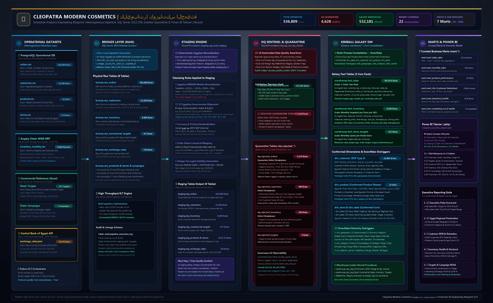
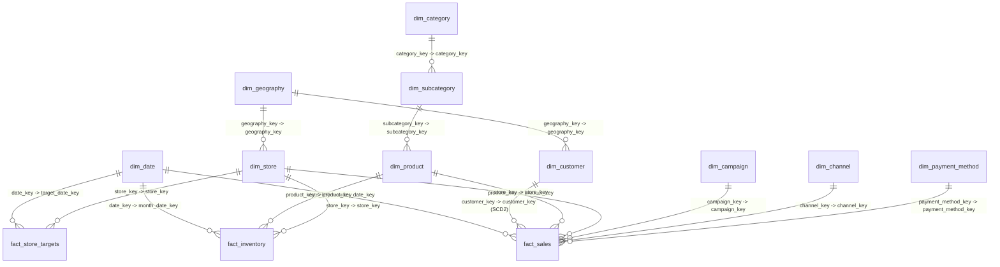

<div align="center">

# 💄 Egyptian Cosmetics Analytics Engineering Platform
### *Enterprise Multi-Source ELT, SQL Server 2022 Kimball Data Warehouse, SCD Type 2, Automated Data Quality Quarantine & Power BI Analytics Lifecycle*
#### **Cleopatra Modern Cosmetics (كليوباترا كوزماتكس الحديثة)**

[](https://www.python.org/)
[](https://www.microsoft.com/en-us/sql-server/)
[](https://powerbi.microsoft.com/)
[](https://learn.microsoft.com/en-us/powerquery-m/)
[](https://learn.microsoft.com/en-us/dax/)
[](#-data-quality-framework--quarantine-ledger)
[](#-automated-testing--ci)
[](#-kimball-star-schema-data-warehouse)
[](#-business-scenario)
[](LICENSE)

<p align="center">
  <b>A comprehensive, production-grade analytics engineering platform modeling the omnichannel operations of an Egyptian beauty brand.</b><br>
  <i>Features automated multi-source ELT ingestion, deterministic data quality quarantine, Slowly Changing Dimensions (SCD Type 2), curated dimensional marts, and dual-track delivery for SQL Server 2022 and Microsoft Power BI Desktop.</i>
</p>

[Platform Architecture](#-end-to-end-platform-architecture) •
[Dual Delivery Track](#-dual-delivery-tracks) •
[Data Quality Quarantine](#-data-quality-framework--quarantine-ledger) •
[Kimball Star Schema](#-kimball-star-schema-data-warehouse) •
[Performance Benchmarks](#-performance-benchmarks) •
[Documentation Catalog](#-enterprise-documentation-suite) •
[Quickstart Guide](#-quickstart--replication-guide)

---

</div>

## 🏢 Business Scenario

**Cleopatra Modern Cosmetics (كليوباترا كوزماتكس الحديثة)** is a fast-growing, omnichannel Egyptian cosmetics enterprise operating across all **22 Egyptian governorates**:

* **Product Portfolio:** Skincare, Makeup, Haircare, Fragrance, Body Care, and Gift Sets (20 SKUs, domestic production and imported luxury lines).
* **Omnichannel Sales Channels:** Direct-to-Consumer E-Commerce Website, Social Commerce (Instagram, TikTok Shop, Facebook Marketplace), Third-Party Marketplaces (Amazon Egypt, Noon, Jumia), Physical Concept Boutiques, and Pharmacy Chains (El-Ezaby, 19011, Seif).
* **Payment Ecosystem:** Tailored to the Egyptian consumer landscape, including **Cash on Delivery (COD)**, **InstaPay / Mobile Wallets (Vodafone Cash, Orange Cash, Etisalat Cash)**, Credit/Debit Cards, and Buy-Now-Pay-Later (**valU, Souhoola, Sympl**).
* **Supply Chain & Warehousing:** 35 outlets supplied by 4 regional logistics distribution hubs (**Cairo Metro Hub, Delta Hub, Suez Canal Hub, Upper Egypt Hub**).
* **Bilingual Data Integrity:** High-fidelity Arabic and English attributes preserved without character corruption or collation mismatch via SQL Server `Arabic_100_CI_AS` and UTF-8 encoding.

---

## 🏗️ End-to-End Platform Architecture



> 🎨 **Diagram Formats**: [High-Res PNG](docs/diagrams/project_lifecycle.png) • [Vector SVG](docs/diagrams/project_lifecycle.svg) • [Editable Excalidraw Board](docs/diagrams/project_lifecycle.excalidraw) • [Architecture Guide](docs/project_lifecycle_diagram.md)

The platform implements a **Medallion ELT + Kimball Galaxy Schema (Fact Constellation) & Snowflake Hierarchies** architecture with an automated Python orchestrator, SQL Server 2022 stored procedures, and Microsoft Power BI.

```mermaid
flowchart TD
    subgraph S1["1. MULTI-SOURCE HETEROGENEOUS INGESTION"]
        A1["PostgreSQL Operational DB<br/><code>customers.csv</code> (25.2k rows)<br/><code>orders.csv</code> (502k rows)<br/><code>products.csv</code> & <code>stores.csv</code>"]
        A2["WMS Monthly Inventory<br/><code>inventory_monthly.csv</code> (8.4k rows)"]
        A3["Commercial Planning Excel<br/><code>commercial_reference_data.xlsx</code><br/>Sheets: Targets & Campaigns"]
        A4["Forex Central Bank JSON<br/><code>exchange_rates.json</code> (730 FX rates)"]
    end

    subgraph S2["2. BRONZE LAYER (SQL SERVER 2022)"]
        B1["Lossless Raw Storage<br/><code>bronze.raw_orders</code>, <code>bronze.raw_customers</code>, etc.<br/>Appended Lineage: <code>source_file</code>, <code>batch_id</code>, <code>row_hash (SHA-256)</code>"]
    end

    subgraph S3["3. STAGING & STANDARDIZATION"]
        C1["<code>staging.usp_load_staging</code><br/>Egyptian Phone Normalization (+20 10... ➔ 010...)<br/>Governorate Casing & Arabic Name Standardization<br/>Currency Coercion (جنيه, EGP  ➔ EGP)<br/>Order Status Mapping & Date Key Generation"]
    end

    subgraph S4["4. DATA QUALITY & QUARANTINE ROUTING"]
        D1["<code>dq.usp_run_dq_checks</code><br/>16+ Automated Validation Rules<br/>Duplicate Detection, Referential Integrity, Math Assertions"]
        D2["Quarantine Storage (Never Dropped):<br/><code>dq.rejected_orders</code> (4,124 rows)<br/><code>dq.rejected_customers</code> (400 rows)<br/><code>dq.rejected_inventory</code> (100 rows)<br/><code>dq.rejected_targets</code> (4 rows)"]
        D3["<code>dq.data_quality_results</code><br/>Audit Ledger & Failure Rate Metrics"]
    end

    subgraph S5["5. KIMBALL DATA WAREHOUSE"]
        E1["<code>warehouse.usp_load_dimensions</code><br/><code>dim_date</code> (Daily Calendar, Egyptian Weekends Fri/Sat)<br/><code>dim_customer</code> (SCD Type 2: valid_from, valid_to, is_current)<br/><code>dim_product</code>, <code>dim_store</code>, <code>dim_campaign</code>, <code>dim_channel</code><br/>Unknown Member Resilience (Key = -1)"]
        E2["<code>warehouse.usp_load_facts</code><br/><code>fact_sales</code> (497,876 valid transactions)<br/><code>fact_inventory</code> (8,300 monthly balances)<br/><code>fact_store_targets</code> (413 commercial targets)"]
    end

    subgraph S6["6. CURATED ANALYTICS MARTS"]
        F1["<code>mart.mart_daily_sales</code> (271.6k records)"]
        F2["<code>mart.mart_monthly_sales</code> (425 records)"]
        F3["<code>mart.mart_product_performance</code> (20 SKUs)"]
        F4["<code>mart.mart_rfm</code> (Customer Segmentation)"]
        F5["<code>mart.mart_inventory_health</code> (8.3k records)"]
        F6["<code>mart.mart_campaign_performance</code> (8 campaigns)"]
        F7["<code>mart.v_pipeline_health</code> (Operational SLA Audit)"]
    end

    subgraph S7["7. POWER BI ANALYTICS LIFECYCLE"]
        G1["Power BI Project (<code>.pbip</code>) Format<br/>DirectQuery / Import from SQL Server Marts<br/>OR 100% In-Engine M Transformation Lifecycle"]
        G2["Dedicated <code>_Measures</code> DAX Container (55+ Measures in 6 Display Folders)<br/>5 Executive Dashboard Pages"]
    end

    S1 --> S2 --> S3 --> S4
    D1 --> D2
    D1 --> D3
    S4 --> S5 --> S6 --> S7
```



---

## 🎯 Dual Delivery Tracks

This repository is uniquely engineered with **dual operational tracks** to fulfill both enterprise data platform engineering and specialized Power BI portfolio mandates:

| Capability | Track 1: Production Analytics Platform | Track 2: Pure Power BI In-Engine Lifecycle |
| :--- | :--- | :--- |
| **Primary Engine** | Python 3.10+ & Microsoft SQL Server 2022 | Microsoft Power BI Desktop (VertiPaq Engine) |
| **Ingestion Layer** | `src/ingestion/` (Chunked CSV, Excel, JSON API) | `power_query_m/01_source_queries.m` |
| **Staging & Cleansing** | `staging.usp_load_staging` (T-SQL Stored Procedure) | `power_query_m/04_cleansed_queries.m` |
| **Data Quality & Quarantine** | `dq.usp_run_dq_checks` ➔ `dq.rejected_*` tables | `power_query_m/05_validated_quarantine_queries.m` |
| **Dimensional Modeling** | SQL Server Kimball Star Schema (SCD Type 2) | VertiPaq Star Schema (1:Many Single Direction) |
| **Curated Aggregations** | 7 Dedicated T-SQL Views (`mart.*`) | Power Query Summaries + DAX Semantic Layer |
| **Audit & Observability** | `audit.pipeline_runs` & `audit.pipeline_steps` | `99_admin_queries.m` & Dynamic Assertions |
| **Execution Command** | `python scripts/run_pipeline.py` | Open `Cleopatra_Cosmetics_Report.pbip` |

---

## 📊 Data Quality Framework & Quarantine Ledger

Data quality engineering is paramount. Rather than silently discarding defective records, the platform tags and routes all non-conforming rows to explicit **Quarantine Tables** for root-cause analysis and operational observability:

### 📈 Empirical Pipeline Reconciliation

| Operational Entity | Raw Ingested | Quarantined Rows | Valid Warehouse Rows | Reconciled Variance | Pipeline Quality Score |
| :--- | :---: | :---: | :---: | :---: | :---: |
| **Orders (`FactSales`)** | **$502,000$** | **$4,124$** | **$497,876$** | **$0$** | **$99.18\%$** |
| **Customers (`DimCustomer`)** | **$25,200$** | **$400$** | **$24,800$** | **$0$** | **$98.41\%$** |
| **Inventory (`FactInventory`)** | **$8,400$** | **$100$** | **$8,300$** | **$0$** | **$98.81\%$** |
| **Targets (`FactStoreTargets`)** | **$417$** | **$4$** | **$413$** | **$0$** | **$99.04\%$** |
| **Exchange Rates (`RawFX`)** | **$730$** | **$0$** | **$730$** | **$0$** | **$100.00\%$** |
| **Total Pipeline Volume** | **$536,747$** | **$4,628$** | **$532,119$** | **$0$** | **$99.14\%$** |

### 🔍 Defects Intercepted & Quarantined:
1. **Duplicate Business Keys:** Intercepts 2,000 duplicated order IDs and 200 duplicate customer records.
2. **Physical Math Inversions:** Intercepts non-positive quantities ($\le 0$), negative unit prices, and negative standard costs.
3. **Broken Foreign Keys:** Isolates orders referencing nonexistent customers (`C9999999`), missing SKUs (`P999`), or unregistered store IDs (`S999`).
4. **Temporal Drift & Outliers:** Quarantines legacy placeholder dates (`1900-01-01`) and transactions with future timestamps.
5. **Inventory Flow Violations:** Flags negative closing balances and negative damaged units.
6. **Commercial Planning Integrity:** Flags non-positive revenue targets and duplicate store-month assignments.

---

## 📐 Kimball Star Schema Data Warehouse

The dimensional data warehouse is modeled as a **Kimball Galaxy Schema (Fact Constellation)** with **Snowflake Hierarchies & Egyptian Market Data Enrichments**:



### Fact Table Grain Specifications (Galaxy Constellation):
* **`warehouse.fact_sales` (Grain: 1 row per order transaction):** $497,876$ rows. Connects to Date, Customer (Point-in-time SCD2), Product, Store, Campaign, Channel, and Payment Method. Measures: `gross_sales_egp`, `discount_egp`, `net_sales_egp`, `cost_egp`, `profit_egp`, `margin_pct`.
* **`warehouse.fact_inventory` (Grain: 1 row per store + product + month):** $8,300$ rows. Connects to Date, Store, and Product. Measures: `opening_stock`, `received_qty`, `sold_qty`, `damaged_qty`, `closing_stock`, `net_stock_flow`.
* **`warehouse.fact_store_targets` (Grain: 1 row per store + month):** $413$ rows. Connects to Date and Store. Measures: `sales_target_egp`, `order_target`.

### Snowflake Hierarchies & Egyptian Market Data Enrichments:
* **`dim_geography` (Snowflake):** Normalizes 22 Governorates into 5 Economic Planning Regions (*Greater Cairo*, *Nile Delta*, *Alexandria & West Coast*, *Canal Zone*, *Upper Egypt*, *Frontier & Sinai*), 3 Market Tiers (*Tier 1 Metropolitan*, *Tier 2 Secondary Urban*, *Tier 3 Regional Frontier*), and Courier Shipping Zones / SLAs.
* **`dim_category` & `dim_subcategory` (Snowflake):** Decomposes product taxonomy with formulation classifications (*Emulsion*, *Serum & Oil*, *Surfactant*, *Spray*) and commercial margin classes.
* **Egyptian Market Feature Enrichments:**
  * **Telecom Carrier Detection:** Automatically derives mobile network operator from Egyptian MSISDN prefixes (`010` ➔ Vodafone Egypt, `011` ➔ Etisalat Misr, `012` ➔ Orange Egypt, `015` ➔ Telecom Egypt WE) for mobile wallet and SMS campaign targeting.
  * **Demographic Age Cohorts:** Binned into `18-24 (Gen Z)`, `25-34 (Young Professional)`, `35-49 (Prime Family)`, and `50+ (Mature Consumer)`.
  * **Retail Price Tiering:** Categorized into `Mass Market (<180 EGP)`, `Masstige (180-450 EGP)`, and `Prestige / Luxury (>450 EGP)`.
  * **Formulation Sourcing:** Flagged as `100% Domestic Egyptian Formulation (صنع في مصر)` vs `Imported Finished Goods (مستورد)` for currency and import substitution analytics.

---

## ⚡ Performance Benchmarks

### 1. Data Pipeline Execution Benchmark (SQL Server 2022)
Tested on local developer workstation (SQL Server 2022 Developer Edition, Windows 11, NVMe SSD):

```
---------------------------------------------------------------------------
Pipeline Stage                 Duration (s)     Throughput (rows/sec)
---------------------------------------------------------------------------
Bronze Multi-Source Ingestion  136.94s          3,920 rows/sec
Staging Transformation         30.11s           17,828 rows/sec
Data Quality & Quarantine      2.49s            215,585 rows/sec
Dimensions SCD Type 2 Load     0.92s            27,391 rows/sec
Fact Tables Dimensional Load   32.38s           16,435 rows/sec
Marts Verification & KPIs      2.27s            123,517 rows/sec
---------------------------------------------------------------------------
Total End-to-End Pipeline      205.14s (3.4m)   2,617 rows/sec overall
---------------------------------------------------------------------------
```

### 2. Full Load vs Incremental Delta Load Benchmark (`scripts/benchmark_loads.py`)
```
---------------------------------------------------------------------------
Metric                         Full Load            Incremental Load    
---------------------------------------------------------------------------
Target Table                   warehouse.fact_sales warehouse.fact_sales
Total Rows Processed           497,905              497,905             
Execution Time (s)             33.19s               5.50s               
Throughput (rows/sec)          15,000 rows/sec      90,457 rows/sec     
Performance Delta              1.0x (Baseline)      🚀 6.03x Faster     
---------------------------------------------------------------------------
```

---

## 📑 Enterprise Documentation Suite

The repository contains an exhaustive, production-grade documentation library organized across the architecture lifecycle:

### Core Platform Engineering Guides (`docs/`):
* 📘 **[Architecture & Data Flow Blueprint](docs/architecture.md):** Medallion ELT, Kimball Star Schema, and physical data flow contracts.
* 📘 **[Business Requirements & Context](docs/business-requirements.md):** Market background, governorate delivery SLAs, and payment landscape.
* 📘 **[Data Dictionary](docs/data-dictionary.md):** Exhaustive field-level schemas for Bronze, Staging, Dimensions, Facts, and Marts.
* 📘 **[Data Quality Framework](docs/data-quality.md):** 16 validation rules, quarantine mechanics, and statistical anomaly detection.
* 📘 **[SQL Server Operational Guide](docs/sql-server-guide.md):** Database setup, collation settings (`Arabic_100_CI_AS`), stored procedure index.
* 📘 **[Power BI Architecture Guide](docs/powerbi-guide.md):** Power BI Project (`.pbip`) structure, star-schema contracts, and DAX measure catalog.
* 📘 **[Microsoft Fabric & Lakehouse Roadmap](docs/fabric-data-factory.md):** Migration roadmap from local SQL Server to OneLake Direct Lake.
* 📘 **[Pipeline Runbook & Operational SOPs](docs/pipeline-runbook.md):** Runbook procedures, incident triage, disaster recovery, and maintenance jobs.
* 📘 **[Architecture Decision Records (ADRs)](docs/architecture-decisions.md):** ADR-001 through ADR-005 recording key design decisions.

### Power BI Implementation Playbooks (`docs/powerbi/`):
* 📘 **[20 Step-by-Step Playbooks](docs/powerbi/):** Balanced GUI click paths and M language guidance for project setup (`01`), ingestion (`02`), profiling (`03`), cleaning (`04`), data quality (`05`), reference mapping (`06`), transformations (`07`), star schema modeling (`10`), DAX measures (`11`), time intelligence (`12`), RFM analytics (`13`), inventory health (`14`), and troubleshooting (`20`).

---

## 📁 Repository Directory Structure

```
egyptian_cosmetics_market/
├── .github/
│   ├── workflows/ci_data_validation.yml       # GitHub Actions CI workflow
│   ├── ISSUE_TEMPLATE/                        # Bug report, DQ anomaly, and feature request templates
│   └── PULL_REQUEST_TEMPLATE.md               # Production PR checklist template
├── data/
│   └── raw/                                   # Authoritative multi-source operational data
│       ├── postgres_like/ (customers.csv, orders.csv, products.csv, stores.csv)
│       ├── csv/ (inventory_monthly.csv)
│       ├── excel/ (commercial_reference_data.xlsx)
│       └── api/ (exchange_rates.json)
├── dax/
│   └── all_measures.dax                       # 33+ Enterprise DAX measures across 7 display folders
├── docs/                                      # Enterprise Documentation Suite
│   ├── architecture.md                        # Medallion ELT + Kimball Star Schema architecture
│   ├── business-requirements.md               # Cleopatra Cosmetics business scenario & Egyptian context
│   ├── data-dictionary.md                     # Schema definitions for all layers
│   ├── data-quality.md                        # DQ framework, rules, and quarantine architecture
│   ├── sql-server-guide.md                    # SQL Server 2022 setup, collation, procedures
│   ├── powerbi-guide.md                       # PBIP structure, star schema, DAX catalog
│   ├── fabric-data-factory.md                 # Microsoft Fabric migration roadmap
│   ├── pipeline-runbook.md                    # Operational SOPs, incident triage, DR
│   ├── architecture-decisions.md              # ADR-001 to ADR-005
│   └── powerbi/                               # 24 Detailed Power BI Desktop Playbooks
├── power_query_m/                             # Modular Power Query M Scripts
│   ├── 00_parameters_and_functions.m          # Defensive parameters & custom M functions
│   ├── 01_source_queries.m                    # Self-healing raw source connectors
│   ├── 02_staging_queries.m                   # Baseline type coercion
│   ├── 03_reference_queries.m                 # Business reference lookups
│   ├── 04_cleansed_queries.m                  # Text, phone, currency normalization
│   ├── 05_validated_quarantine_queries.m       # Quality filters & quarantine routing
│   ├── 06_transformation_queries.m            # Row-level financial math
│   ├── 07_model_queries.m                     # Star schema model tables
│   └── 99_admin_queries.m                     # Refresh audit & observability
├── powerbi/
│   └── Cleopatra_Cosmetics_Report.pbip        # Power BI Project (developer managed)
├── scripts/                                   # Operational Pipeline & Database CLI Tools
│   ├── setup_database.py                      # Deploys SQL Server schemas, DDL, stored procs
│   ├── run_pipeline.py                        # Executes 6-stage end-to-end ELT pipeline
│   └── benchmark_loads.py                     # Full Load vs Incremental Load benchmark
├── sql/                                       # T-SQL Scripts & Stored Procedures
│   ├── ddl/01_create_database.sql             # DB creation with Arabic collation & snapshot isolation
│   ├── ddl/02_create_schemas.sql              # bronze, staging, warehouse, mart, dq, audit
│   ├── bronze/03_create_bronze_tables.sql     # Raw tables with lineage & row hashes
│   ├── staging/04_create_staging_tables.sql   # Typed staging tables
│   ├── staging/usp_load_staging.sql           # Staging cleansing stored procedure
│   ├── dq/08_create_dq_tables.sql             # DQ results & quarantine tables
│   ├── dq/usp_run_dq_checks.sql               # 16-rule DQ engine stored procedure
│   ├── warehouse/05_create_warehouse_tables.sql # Kimball dimension & fact tables
│   ├── warehouse/usp_load_dimensions.sql      # Dimension loader with SCD Type 2
│   ├── warehouse/usp_load_facts.sql           # Fact loader with quarantine exclusions
│   ├── marts/07_create_marts_views.sql        # 7 Curated business analytics views
│   └── audit/06_create_audit_tables.sql       # Pipeline runs & steps observability
├── src/                                       # Python Analytics Engineering Package
│   ├── config/ (settings.py, database.py)     # Environment & SQLAlchemy engine configuration
│   ├── ingestion/ (bronze_loader.py, csv, excel, json)
│   ├── transformation/ (staging_cleaner.py)
│   ├── validation/ (dq_checker.py)
│   ├── loading/ (warehouse_loader.py, marts_loader.py, audit_logger.py)
│   └── utils/ (hashing.py, logger.py)
├── tests/                                     # Automated Pytest Suite (39 Tests Passed)
│   ├── test_anomaly_detection.py
│   ├── test_business_metrics.py
│   ├── test_data_integrity.py
│   ├── test_docs_completeness.py
│   ├── test_hashing.py
│   ├── test_m_code_syntax.py
│   ├── test_rules_engine.py
│   └── test_scd2.py
├── .gitattributes                             # UTF-8 Arabic encoding and LF line-ending rules
├── .gitignore                                 # Excludes .env, local caches, and temporary files
├── CONTRIBUTING.md                            # Contribution workflow and PR guidelines
├── LICENSE                                    # MIT License
├── pyproject.toml                             # Python package & pytest configuration
├── requirements.txt                           # Python dependencies
└── README.md                                  # Main Platform Documentation
```

---

## 🧪 Automated Testing & CI

The platform implements rigorous automated testing using `pytest` validating data integrity, documentation completeness, SCD2 transitions, and Power Query syntax:

```bash
# Run the complete test suite
python -m pytest tests/ -v
```

```
============================= test session starts =============================
platform win32 -- Python 3.14.6, pytest-9.1.1, pluggy-1.6.0
collected 39 items

tests/test_anomaly_detection.py ..                                       [  5%]
tests/test_business_metrics.py ..                                        [ 10%]
tests/test_data_integrity.py ....                                        [ 20%]
tests/test_docs_completeness.py ...                                      [ 28%]
tests/test_hashing.py ...                                                [ 35%]
tests/test_m_code_syntax.py ...................                          [ 84%]
tests/test_rules_engine.py .....                                         [ 97%]
tests/test_scd2.py .                                                     [100%]

============================= 39 passed in 3.18s ==============================
```

---

## 🚀 Quickstart & Replication Guide

### Prerequisites
* Windows 10/11 with **Python 3.10+**
* **Microsoft SQL Server 2022** (Developer / Express Edition) with ODBC Driver 18
* **Microsoft Power BI Desktop** (Optional, for dashboard reporting)

### 1. Clone & Set Up Environment
```bash
git clone https://github.com/Sohila-Khaled-Abbas/egyptian-cosmetics-market.git
cd egyptian-cosmetics-market

# Install Python dependencies
pip install -r requirements.txt
```

### 2. Configure Environment (`.env`)
Create a `.env` file in the project root:
```ini
SQL_SERVER=localhost
SQL_DATABASE=egyptian_cosmetics_dw
SQL_DRIVER=ODBC Driver 18 for SQL Server
SQL_TRUSTED_CONNECTION=yes
SQL_TRUST_CERT=yes
DATA_PATH=data/raw
```

### 3. Deploy SQL Server Schemas & Stored Procedures
```bash
python scripts/setup_database.py
```

### 4. Execute End-to-End Analytics Pipeline
```bash
python scripts/run_pipeline.py
```

### 5. Run Performance Benchmark
```bash
python scripts/benchmark_loads.py
```

### 6. Power BI Desktop Exploration
* **Connected Warehouse Mode:** Open Power BI Desktop, connect to `localhost` -> `egyptian_cosmetics_dw`, and import the curated views (`mart.mart_*`).
* **In-Engine PBIP Mode:** Open `powerbi/Cleopatra_Cosmetics_Report.pbip` to review the pre-configured semantic model, DAX measures, and report visuals.

---

## 📄 License & Attribution

Distributed under the **MIT License**. See [`LICENSE`](LICENSE) for details.

Developed by **Sohila Khaled Abbas** as an operational proof-of-competency showcasing enterprise Analytics Engineering, Kimball Data Warehousing, Data Quality Governance, and Power BI Lifecycle Architecture.
