# Enterprise Analytics Engineering Platform Architecture

## 1. Executive Architecture Overview

The **Egyptian Cosmetics Analytics Engineering Platform** for **Cleopatra Modern Cosmetics (كليوباترا كوزماتكس الحديثة)** is built on a modern, decoupled **Medallion & Kimball Galaxy Schema (Fact Constellation) & Snowflake Hierarchies** architecture. It ingests multi-source transactional, customer, catalog, supply chain, and marketing data, enforces rigorous data quality controls, manages historical customer dimensions with **Slowly Changing Dimensions Type 2 (SCD2)**, enriches core dimensions with authentic Egyptian market attributes, and curates high-performance analytics marts for executive and operational intelligence.

```mermaid
flowchart TD
    subgraph "Operational Sources"
        S1["PostgreSQL Store DB<br/>(orders, customers, products, stores)"]
        S2["ERP Supply Chain CSV<br/>(monthly inventory)"]
        S3["Commercial Planning Excel<br/>(targets, campaigns)"]
        S4["Forex Central Bank API<br/>(exchange_rates JSON)"]
    end

    subgraph "Bronze Layer (Lossless Ingestion)"
        B1["bronze.raw_orders"]
        B2["bronze.raw_customers"]
        B3["bronze.raw_products"]
        B4["bronze.raw_stores"]
        B5["bronze.raw_inventory"]
        B6["bronze.raw_targets"]
        B7["bronze.raw_campaigns"]
        B8["bronze.raw_exchange_rates"]
    end

    subgraph "Staging Layer (Standardization & Cleanse)"
        STG1["staging.stg_orders"]
        STG2["staging.stg_customers"]
        STG3["staging.stg_products"]
        STG4["staging.stg_stores"]
        STG5["staging.stg_inventory"]
        STG6["staging.stg_targets"]
        STG7["staging.stg_campaigns"]
    end

    subgraph "Data Quality & Quarantine"
        DQ["dq.usp_run_dq_checks"]
        Q1["dq.rejected_orders"]
        Q2["dq.rejected_customers"]
        Q3["dq.rejected_inventory"]
        Q4["dq.rejected_targets"]
        LEDGER["dq.data_quality_results"]
    end

    subgraph "Warehouse Layer (Kimball Galaxy Schema / Fact Constellation)"
        subgraph "Snowflake Dimension Hierarchies"
            DIM_GEO["dim_geography (Governorates, Regions, Tiers, Shipping SLAs)"]
            DIM_CAT["dim_category (Strategic Margin Tiers)"]
            DIM_SUBCAT["dim_subcategory (Formulation Types)"]
        end

        subgraph "Conformed Dimensions"
            DIM_D["warehouse.dim_date"]
            DIM_C["warehouse.dim_customer (SCD2 + Telecom & Demographics)"]
            DIM_P["warehouse.dim_product (Price Segments & Formulation Origin)"]
            DIM_S["warehouse.dim_store (Footprint Class & Logistics Hub)"]
            DIM_CMP["warehouse.dim_campaign"]
            DIM_CH["warehouse.dim_channel"]
            DIM_PM["warehouse.dim_payment_method"]
        end
        
        subgraph "Multi-Grain Galaxy Facts"
            FACT_S["warehouse.fact_sales (Order Line-Item Grain)"]
            FACT_I["warehouse.fact_inventory (Store Monthly Snapshot Grain)"]
            FACT_T["warehouse.fact_store_targets (Store Monthly Quota Grain)"]
        end
    end

    subgraph "Curated Analytics Marts"
        M1["mart.mart_daily_sales"]
        M2["mart.mart_monthly_sales"]
        M3["mart.mart_product_performance"]
        M4["mart.mart_rfm"]
        M5["mart.mart_inventory_health"]
        M6["mart.mart_campaign_performance"]
        M7["mart.v_pipeline_health"]
    end

    subgraph "Semantic Consumption Layer"
        PBI["Power BI Enterprise Semantic Model<br/>(Cleopatra_Cosmetics_Report.pbip)"]
        FABRIC["Microsoft Fabric Lakehouse / Direct Lake"]
    end

    S1 & S2 & S3 & S4 --> B1 & B2 & B3 & B4 & B5 & B6 & B7 & B8
    B1 & B2 & B3 & B4 & B5 & B6 & B7 & B8 --> STG1 & STG2 & STG3 & STG4 & STG5 & STG6 & STG7
    STG1 & STG2 & STG3 & STG4 & STG5 & STG6 & STG7 --> DQ
    DQ -->|Violations| Q1 & Q2 & Q3 & Q4
    DQ -->|Metrics| LEDGER
    DQ -->|Clean Records| DIM_D & DIM_C & DIM_P & DIM_S & DIM_CMP & DIM_CH & DIM_PM
    DIM_D & DIM_C & DIM_P & DIM_S & DIM_CMP & DIM_CH & DIM_PM --> FACT_S & FACT_I & FACT_T
    FACT_S & FACT_I & FACT_T --> M1 & M2 & M3 & M4 & M5 & M6 & M7
    M1 & M2 & M3 & M4 & M5 & M6 & M7 --> PBI & FABRIC
```

---

## 2. Layer-by-Layer Separation of Concerns

### 2.1 Bronze Layer (`bronze.*`)
- **Purpose**: High-throughput, lossless ingestion of raw operational files.
- **Rules**:
  - All source columns stored as strings/lossless representations.
  - Mandatory audit columns: `source_system`, `source_file`, `ingestion_timestamp`, `batch_id`, and `row_hash` (SHA-256).
  - No transformations, no business logic, no row drops.

### 2.2 Staging Layer (`staging.*`)
- **Purpose**: Schema typing, structural standardization, and data cleansing.
- **Transformations Handled in `staging.usp_load_staging`**:
  - **Phone Normalization**: Strips spaces, symbols, converts `+20 10...` to local Egyptian standard `010...`.
  - **Governorate Unification**: Cleans capitalization and compound governorate spelling (`cairo` $\rightarrow$ `Cairo`, `Kafrelsheikh` $\rightarrow$ `Kafr El Sheikh`).
  - **Currency Canonicalization**: Maps `EGP `, `جنيه`, `جنيه مصري` to ISO standard `EGP`.
  - **Lifecycle Status Casing**: Maps `complete`, `Complete`, `مكتمل` $\rightarrow$ `Completed`.
  - **Temporal Keys**: Generates integer surrogate date keys (e.g. `20250517`).

### 2.3 Data Quality & Quarantine Layer (`dq.*`)
- **Purpose**: Automated assertion evaluation and quarantine routing.
- **Execution**: Orchestrated by `dq.usp_run_dq_checks`.
- **Behavior**:
  - Defective records are isolated into `dq.rejected_orders`, `dq.rejected_customers`, `dq.rejected_inventory`, and `dq.rejected_targets` along with exact `rejection_reason`, `rule_id`, and `quarantine_timestamp`.
  - The warehouse load strictly filters out quarantined keys, guaranteeing that downstream fact and dimension tables contain **zero dirty records**.
  - All rule evaluations log total records, failed records, pass rate %, and execution status to `dq.data_quality_results`.

### 2.4 Warehouse Layer (`warehouse.*`)
- **Purpose**: Kimball dimensional modeling deployed as a **Galaxy Schema (Fact Constellation) with Snowflake Hierarchies**.
- **Galaxy Multi-Grain Facts**:
  - `fact_sales`: 1 row per validated order transaction line item ($499,903$ rows).
  - `fact_inventory`: 1 row per store + product monthly inventory snapshot ($8,300$ rows).
  - `fact_store_targets`: 1 row per store + month commercial quota ($415$ rows).
  - Multi-process facts share conformed dimensions (`dim_date`, `dim_product`, `dim_store`), preventing chasm traps and enabling cross-process analytics (e.g. stockout lost sales vs actuals).
- **Snowflake Hierarchies & Data Enrichment**:
  - `dim_geography`: Normalizes 22 Governorates into 5 Economic Regions, 3 Market Development Tiers, and Courier Shipping Zones / SLAs.
  - `dim_subcategory` & `dim_category`: Normalizes product hierarchies with strategic gross margin classifications and formulation types.
  - Enriched Attributes: Egyptian Telecom carrier detection (Vodafone 010, Orange 012, Etisalat 011, WE 015), demographic age cohorts, retail price point tiers (Mass, Masstige, Luxury), and formulation origin (Domestic Egyptian vs Imported).
- **Surrogate Keys**: Integer / BigInt identity keys with point-in-time SCD2 resolution.
- **Unknown Member Resilience**: All dimensions contain a `-1` unknown member row to gracefully absorb unexpected or null operational references without breaking joins.

### 2.5 Analytics Marts Layer (`mart.*`)
- **Purpose**: Pre-aggregated, query-optimized views for BI consumption.
- **Views**:
  - `mart_daily_sales`: Daily revenue, units, gross margin %, and running totals.
  - `mart_monthly_sales`: Monthly revenue vs targets, variance, and order volume.
  - `mart_product_performance`: Category, subcategory, and brand sales velocity and profitability.
  - `mart_rfm`: Customer recency, frequency, monetary quantiles, and segment classifications.
  - `mart_inventory_health`: Stockout risk indicators, inventory valuation, and damage rates.
  - `mart_campaign_performance`: ROI, acquisition volume, and conversion metrics.
  - `v_pipeline_health`: Audit dashboard view joining `audit.pipeline_runs` and `dq.data_quality_results`.

---

## 3. Storage, Indexes, & Performance Optimization

1. **Arabic Collation**:
   The database utilizes `Arabic_100_CI_AS` (Arabic 100, Case-Insensitive, Accent-Sensitive) to seamlessly handle bilingual Egyptian Arabic and English searches while preventing collation conflicts.
2. **Snapshot Isolation**:
   Enabled (`ALLOW_SNAPSHOT_ISOLATION ON`, `READ_COMMITTED_SNAPSHOT ON`) to eliminate read-write blocking during concurrent ETL loads and BI report queries.
3. **Index Strategy**:
   - Clustered primary keys on surrogate keys.
   - Non-clustered indexes on all foreign keys (`date_key`, `customer_key`, `product_key`, `store_key`, `channel_key`).
   - Composite non-clustered index on `dim_customer(customer_id, is_current)` for ultra-fast SCD2 point-in-time lookups.
