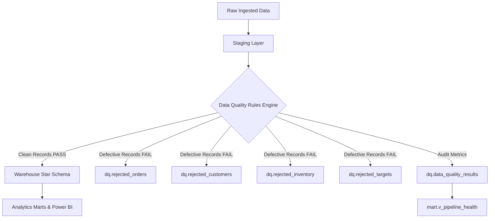

# Data Quality Engineering & Quarantine Architecture

## 1. Architectural Philosophy: Never Discard, Never Corrupt

A common beginner pattern in data pipelines is either:
1. **Silent Dropping**: Using `INNER JOIN` or `WHERE` filters to silently drop corrupt rows without notifying stakeholders, masking serious upstream ERP or POS issues.
2. **Catastrophic Failure**: Crashing the entire production pipeline upon encountering a single dirty record.

In the **Cleopatra Modern Cosmetics Platform**, we implement an **Enterprise Quarantine Pattern**:
- Every incoming record is audited against strict business and structural assertions.
- Corrupted or anomalous records are **intercepted and routed** to dedicated quarantine tables (`dq.rejected_*`), preserving the original row, the exact `rejection_reason`, and execution metadata.
- Downstream Kimball dimensions and facts load **only certified, clean data**.
- Data quality health is tracked quantitatively in `dq.data_quality_results`, powering the executive **Data Quality & Observability Dashboard**.



---

## 2. Core Data Quality Rule Catalog

| Rule ID | Table | Column | Rule Type | Severity | Description | Action on Failure |
| :--- | :--- | :--- | :--- | :--- | :--- | :--- |
| **ORD_PK_01** | `stg_orders` | `order_id` | Uniqueness | Critical | Order ID must be globally unique across all channels | Quarantine duplicate |
| **ORD_NN_01** | `stg_orders` | `order_id` | Completeness | Critical | Order ID must not be null or empty | Quarantine row |
| **ORD_FK_01** | `stg_orders` | `customer_id` | Referential | Critical | Customer ID must exist in customer master | Quarantine orphan |
| **ORD_FK_02** | `stg_orders` | `product_id` | Referential | Critical | Product ID must exist in product catalog | Quarantine orphan |
| **ORD_FK_03** | `stg_orders` | `store_id` | Referential | Critical | Store ID must exist in store master | Quarantine orphan |
| **ORD_RNG_01**| `stg_orders` | `quantity` | Range | Critical | Quantity must be strictly positive ($\ge 1$) | Quarantine non-positive |
| **ORD_RNG_02**| `stg_orders` | `unit_price` | Range | Critical | Unit price must be strictly non-negative ($\ge 0$) | Quarantine negative price |
| **ORD_DT_01** | `stg_orders` | `order_datetime`| Range | Critical | Timestamp between `2020-01-01` and current UTC time | Quarantine future/legacy |
| **CUST_PK_01**| `stg_customers`| `customer_id` | Uniqueness | Critical | Customer ID must be unique in master feed | Quarantine duplicate |
| **CUST_NN_01**| `stg_customers`| `customer_id` | Completeness | Critical | Customer ID cannot be null | Quarantine row |
| **CUST_NN_02**| `stg_customers`| `customer_name`| Completeness | Warning | Customer name cannot be empty | Quarantine row |
| **CUST_CNT_01**| `stg_customers`| `phone`/`email` | Completeness | Warning | Customer must have at least phone OR email | Flag warning |
| **INV_RNG_01** | `stg_inventory`| `closing_stock`| Range | Critical | Closing stock cannot be negative ($< 0$) | Quarantine anomaly |
| **INV_RNG_02** | `stg_inventory`| `damaged_qty` | Range | Critical | Damaged units cannot be negative ($< 0$) | Quarantine anomaly |
| **INV_RNG_03** | `stg_inventory`| `sold_qty` | Plausibility | Warning | Monthly sold units $> 10,000$ requires audit | Quarantine anomaly |
| **TGT_PK_01** | `stg_targets` | `store_id` | Uniqueness | Critical | Only 1 target per store per year-month | Quarantine duplicate |

---

## 3. Quarantine Schema Specification

### 3.1 `dq.rejected_orders`
Stores all quarantined order records with full contextual reason:
- `order_id`, `order_datetime`, `customer_id`, `product_id`, `store_id`, `quantity`, `unit_price_egp`, `order_status`, `currency`
- `rejection_reason`: Semicolon-separated audit description (e.g. `'Duplicate Order ID; Orphan Order - Product ID not in Product Master'`)
- `rejection_severity`: `'Critical'`
- `quarantine_timestamp`: UTC datetime of detection
- `batch_id`: Pipeline run identifier

---

## 4. Execution & Observability

### 4.1 SQL Server Automated Procedure
The stored procedure `dq.usp_run_dq_checks` runs during Stage 3 of the pipeline. It evaluates the 16 rules, populates the quarantine tables, and writes rule-by-rule statistics to `dq.data_quality_results`:
```sql
EXEC dq.usp_run_dq_checks @RunId = 'RUN_20250921_120000', @BatchId = 'BATCH_001';
```

### 4.2 Python Rules Engine
The Python module `src/validation/rules_engine.py` provides identical vectorized checks in pandas for unit testing and CI/CD pipelines:
- `RulesEngine.check_uniqueness(df, "order_id")`
- `RulesEngine.check_positive_numeric(df, "quantity")`
- `RulesEngine.check_non_negative(df, "closing_stock")`
- `RulesEngine.check_foreign_key(df, "customer_id", valid_set)`
- `RulesEngine.check_date_range(df, "order_datetime", min_date, max_date)`
