# Future Production Architecture: Enterprise Scaling Roadmap

## 1. Executive Summary & Context

The current implementation of the **Egyptian Cosmetics Analytics** platform purposefully executes the complete data lifecycle inside **Power BI Desktop** using Power Query (M) and the Tabular VertiPaq engine. This proves that Power BI can independently extract, profile, cleanse, validate, quarantine, model, and analyze heterogeneous operational data without external preprocessing.

As Cleopatra Modern Cosmetics scales from $500,000$ transactions to tens of millions of records across regional Middle Eastern markets, enterprise architecture dictates transitioning heavy ETL and storage to dedicated cloud data platforms.

This document outlines the **Future Production Architecture**, demonstrating how the exact business rules, data quality thresholds, and dimensional models developed in Power BI translate seamlessly into:
1. **Python / Pandas / PySpark** (Orchestrated data engineering)
2. **PostgreSQL / SQL Server / Snowflake** (Relational staging & data warehousing)
3. **Microsoft Fabric (Data Factory & OneLake)** (SaaS lakehouse architecture)
4. **dbt (data build tool)** (Declarative SQL transformations and testing)

---

## 2. Cloud Lakehouse Target Architecture

```mermaid
flowchart LR
    subgraph Sources["Raw Ingestion"]
        S1[Postgres Operational Dumps]
        S2[Commercial Excel Workbooks]
        S3[WMS Inventory Logs]
        S4[REST FX Rates API]
    end

    subgraph Fabric["Microsoft Fabric Lakehouse / Cloud DW"]
        F1["Bronze Layer\n(Raw Delta Parquet in OneLake)"]
        F2["Silver Layer\n(dbt / PySpark Cleaned & Tested)"]
        F3["Gold Layer\n(Kimball Star Schema Dim/Fact)"]
    end

    subgraph PowerBI["Semantic & Presentation Layer"]
        P1["Power BI Direct Lake / Import\n(Thin Semantic Model + DAX)"]
        P2["Executive & Operational Dashboards"]
    end

    Sources -->|Fabric Data Factory / ADF| F1
    F1 -->|dbt Transformations + DQ Tests| F2
    F2 -->|dbt Dimensional Modeling| F3
    F3 -->|Direct Lake Sub-Second Querying| P1
    P1 --> P2
```



---

## 3. Technology Mapping: Power Query (M) to Modern Data Stack

Every transformation and quality rule engineered in Power Query maps 1-to-1 to modern data engineering frameworks:

| Lifecycle Stage | Current Power BI (M) Implementation | Future Production Stack (Python / SQL / dbt) |
| :--- | :--- | :--- |
| **Ingestion & Decoupling** | `01_Source` & `02_Staging`<br>`File.Contents`, `Csv.Document`, `Excel.Workbook` | **Azure Data Factory / Fabric Pipelines** copy raw files directly into ADLS Gen2 / OneLake **Bronze Tables** as raw Delta Parquet. |
| **Text & Currency Cleaning** | `04_Cleansed`<br>`fnCleanText`, `fnNormalizeCurrency` | **dbt Macro / SQL UDF**: Regex string replacement, upper/lower standardization, mapping currency aliases via standard SQL `CASE` or reference tables. |
| **Data Quality Validation** | `05_Validated`<br>`vld_orders_prep` adding boolean flags | **dbt-expectations / Great Expectations**:<br>`expect_column_values_to_be_between(0, 1000)`<br>`expect_column_values_to_not_be_null()`<br>`expect_table_row_count_to_equal_other_table()`. |
| **Quarantine & Rejection** | `rejected_orders`<br>Splitting rows by `DataQualityStatus` | **dbt Silver Routing / SQL MERGE**: Invalid records are inserted into a dedicated `audit.quarantine_orders` table with error codes. |
| **Line-Item Financial Math**| `06_Transformations`<br>`trf_sales` computing Gross, Net, COGS | **dbt Incremental Models**: SQL window functions and arithmetic pre-materializing `gross_sales_egp`, `net_sales_egp`, and `cost_egp`. |
| **Surrogate Keys** | `Table.AddIndexColumn` in Power Query | **dbt / SQL Warehouse**: Deterministic surrogate keys using `dbt_utils.generate_surrogate_key(['order_id'])` (MD5 hash) or identity sequences. |
| **Date Dimension** | `dim_date` generated via `List.Dates` in M | **dbt_date** package: Pre-populated SQL date table with fiscal calendars, holiday markers, and bilingual Arabic month names. |
| **Serving Layer** | Tabular VertiPaq Import Model | **Power BI Direct Lake Mode**: Queries Gold Delta tables directly from memory without data movement or scheduled import refresh. |

---

## 4. Production Migration Code Equivalents

### 4.1: SQL / dbt Transformation Example (`stg_orders.sql` $\rightarrow$ `fct_sales.sql`)

```sql
-- models/silver/stg_orders.sql
WITH raw_orders AS (
    SELECT * FROM {{ source('bronze', 'raw_orders') }}
),

standardized AS (
    SELECT
        TRIM(order_id) AS order_id,
        CAST(order_datetime AS TIMESTAMP) AS order_datetime,
        TRIM(customer_id) AS customer_id,
        TRIM(product_id) AS product_id,
        TRIM(store_id) AS store_id,
        TRIM(campaign_id) AS campaign_id,
        TRIM(sales_channel_en) AS sales_channel_en,
        TRIM(payment_method_en) AS payment_method_en,
        CAST(quantity AS INTEGER) AS quantity,
        CAST(unit_price_egp AS NUMERIC(12,2)) AS unit_price_egp,
        CAST(discount_pct AS NUMERIC(5,4)) AS discount_pct,
        -- Status Normalization
        CASE 
            WHEN LOWER(TRIM(order_status)) IN ('completed', 'complete', 'مكتمل') THEN 'Completed'
            WHEN LOWER(TRIM(order_status)) IN ('cancelled', 'canceled', 'ملغي') THEN 'Cancelled'
            WHEN LOWER(TRIM(order_status)) IN ('returned', 'مرتجع') THEN 'Returned'
            ELSE 'Pending'
        END AS order_status,
        -- Currency Normalization
        CASE 
            WHEN TRIM(currency) IN ('EGP', 'EGP ', 'جنيه', 'جنيه مصري') THEN 'EGP'
            ELSE TRIM(currency)
        END AS currency
    FROM raw_orders
)
SELECT * FROM standardized;
```

### 4.2: dbt Data Quality Assertion Example (`schema.yml`)

```yaml
version: 2

models:
  - name: fct_sales
    description: "Production Kimball Star Schema Sales Fact Table"
    columns:
      - name: order_id
        tests:
          - unique
          - not_null
      - name: customer_id
        tests:
          - relationships:
              to: ref('dim_customer')
              field: customer_id
      - name: quantity
        tests:
          - dbt_expectations.expect_column_values_to_be_between:
              min_value: 1
      - name: unit_price_egp
        tests:
          - dbt_expectations.expect_column_values_to_be_between:
              min_value: 0.01
```

---

## 5. Architectural Trade-Off Analysis

| Architectural Trait | Current Power BI Self-Contained Solution | Future Cloud Lakehouse (Fabric + dbt) |
| :--- | :--- | :--- |
| **Infrastructure Overhead** | **Zero.** Runs entirely on local desktop or standard Power BI Pro/Premium license. No cloud database costs. | **Moderate to High.** Requires Azure/Fabric tenant, compute capacity (F-SKUs), and storage billing. |
| **Team Skillset Required** | Power BI Developer, Analytics Engineer fluent in M & DAX. | Multi-disciplinary team: Data Engineer (Python/Fabric), Analytics Engineer (SQL/dbt), BI Developer. |
| **Maximum Data Volume** | Ideal for $100,000$ to $10,000,000$ rows (within desktop RAM limits). | Scalable to billions of transactions across distributed Spark/Delta clusters. |
| **Reusability Across Tools** | Logic resides in PBIX; other tools (e.g. Tableau or Python notebooks) cannot directly query M logic. | Logic resides in OneLake Gold tables; accessible to Power BI, Python, ML models, and ad-hoc SQL. |

---

## 6. Conclusion

The business logic, schema relationships, data quality thresholds, and reconciliation frameworks established in this Power BI project form the **functional blueprint** for future enterprise cloud migrations. Because every transformation in M was developed modularly with Kimball dimensional modeling, migrating to Microsoft Fabric or dbt requires zero re-engineering of business logic—only a translation of syntax.
