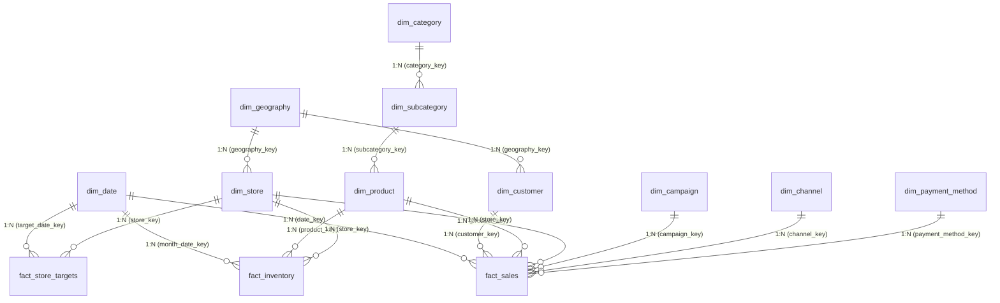

# Power BI Enterprise Developer & Semantic Modeling Guide

## 1. Project Format: `Cleopatra_Cosmetics_Report.pbip`

This project is authored in the modern **Power BI Project (`.pbip`)** format located at:
`powerbi/Cleopatra_Cosmetics_Report.pbip`

### 1.1 Directory Structure
```
powerbi/
├── Cleopatra_Cosmetics_Report.pbip             # Root project descriptor
├── Cleopatra_Cosmetics_Report.Report/          # Report visual metadata & layouts (JSON)
│   ├── definition.pbir
│   └── report.json
└── Cleopatra_Cosmetics_Report.SemanticModel/   # Tabular semantic model definition (TMDL)
    ├── definition/
    │   ├── model.tmdl
    │   ├── expressions.tmdl                    # Parameters & Power Query M code
    │   └── tables/                             # Table & DAX measure definitions
    └── definition.pbism
```

---

## 2. Galaxy Schema (Fact Constellation) & Snowflake Relationship Contracts

All relationships within the tabular data model are strictly **1:Many ($1:*$)** from Dimension to Fact or Parent to Child Dimension with **Single** cross-filter direction:



### Golden Rules of Dimensional Modeling in Power BI:
1. **Never create Many-to-Many relationships**: Eliminate bridge tables by resolving composite keys upstream in Power Query or SQL Server.
2. **Never enable Bi-directional cross-filtering**: Bi-directional filtering causes ambiguous calculation paths and degrades VertiPaq engine performance.
3. **Hide Foreign Keys in Report View**: Hide all surrogate foreign key columns (`*_key`) on fact tables so report authors only drag clean descriptive attributes from dimensions.

---

## 3. Semantic Layer & DAX Measure Architecture

All business logic resides in a dedicated measure table `_Measures`, organized into 7 standardized display folders:

### 3.1 Financial KPIs
- `[Gross Sales] = SUM(fact_sales[gross_sales_egp])`
- `[Discount Amount] = SUM(fact_sales[discount_egp])`
- `[Net Sales] = SUM(fact_sales[net_sales_egp])`
- `[Total Cost] = SUM(fact_sales[cost_egp])`
- `[Gross Profit] = [Net Sales] - [Total Cost]`
- `[Gross Margin %] = DIVIDE([Gross Profit], [Net Sales], 0)`
- `[Discount %] = DIVIDE([Discount Amount], [Gross Sales], 0)`

### 3.2 Volume & Order KPIs
- `[Total Orders] = DISTINCTCOUNT(fact_sales[order_id])`
- `[Units Sold] = SUM(fact_sales[quantity])`
- `[Average Order Value (AOV)] = DIVIDE([Net Sales], [Total Orders], 0)`
- `[Average Selling Price (ASP)] = DIVIDE([Net Sales], [Units Sold], 0)`
- `[Return Rate %] = DIVIDE(CALCULATE([Total Orders], fact_sales[order_status] = "Returned"), [Total Orders], 0)`

### 3.3 Target Achievement KPIs
- `[Sales Target] = SUM(fact_store_targets[sales_target_egp])`
- `[Target Variance EGP] = [Net Sales] - [Sales Target]`
- `[Target Achievement %] = DIVIDE([Net Sales], [Sales Target], 0)`

### 3.4 Time Intelligence (Custom Calendar DimDate)
- `[Sales YTD] = TOTALYTD([Net Sales], dim_date[full_date])`
- `[Sales QTD] = TOTALQTD([Net Sales], dim_date[full_date])`
- `[Sales MTD] = TOTALMTD([Net Sales], dim_date[full_date])`
- `[Sales PY] = CALCULATE([Net Sales], SAMEPERIODLASTYEAR(dim_date[full_date]))`
- `[YoY Sales Growth %] = DIVIDE([Net Sales] - [Sales PY], [Sales PY], 0)`

---

## 4. Dual Workflow: Power Query GUI vs Advanced Editor M Code

The project supports both visual drag-and-drop developers and code-first analytics engineers:

| Task | GUI Method (Ribbon / Context Menus) | M Code Equivalent |
| :--- | :--- | :--- |
| **Create Parameter** | `Home` $\rightarrow$ `Manage Parameters` $\rightarrow$ `New Parameter` | `"D:\data" meta [IsParameterQuery=true...]` |
| **Normalize Phone** | `Transform` $\rightarrow$ `Replace Values` | `Text.Replace(Text.Replace(phone, " ", ""), "+20", "0")` |
| **Trim Text** | Select column $\rightarrow$ `Transform` $\rightarrow$ `Format` $\rightarrow$ `Trim` | `Table.TransformColumns(tbl, {{"name", Text.Trim}})` |
| **Change Data Types** | Click icon in column header $\rightarrow$ Select type | `Table.TransformColumnTypes(tbl, {{"col", type text}})` |
| **Invoke Custom Function** | `Add Column` $\rightarrow$ `Invoke Custom Function` | `Table.AddColumn(tbl, "Clean", each fnCleanText([col]))` |
| **Reference Query** | Right-click query $\rightarrow$ `Reference` | `Source = src_query` |
| **Disable Load** | Right-click query $\rightarrow$ Uncheck `Enable Load` | Managed in TMDL / PBIP table metadata |
