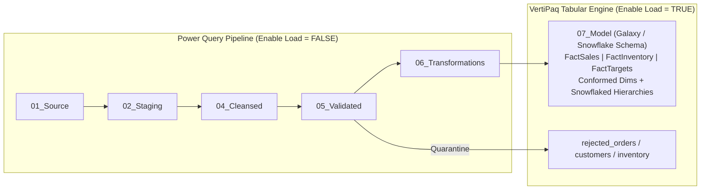

# Playbook 01: Power BI Project Setup & Environment Configuration

## 1. Objective & Scope

This playbook guides the Senior Analytics Engineer through creating, configuring, and structuring the enterprise Power BI Project (`Cleopatra_Cosmetics_Report.pbip`). It establishes parameterization to ensure zero hardcoded file paths, creates the 8 required query groups, sets report options, configures locale-sensitive formatting for Egypt, and ensures complete clarity using a **balanced mix of Power Query GUI clicks and M code**.

---

## 2. Step-by-Step Power BI Desktop Setup

### Step 2.1: Initialize New Project & Global Options
1. Launch **Power BI Desktop**.
2. Click **File** $\rightarrow$ **Save As** $\rightarrow$ Select file type **Power BI Project (*.pbip)**:
   - File name: `Cleopatra_Cosmetics_Report.pbip`
   - Location: `d:\courses\Data Science\Data Engineering\Projects\egyptian_cosmetics_market\powerbi`
   > [!NOTE]
   > **Why PBIP over PBIX?**
   > The Power BI Project (`.pbip`) format stores dataset definitions in TMDL (Tabular Model Definition Language) and report metadata in JSON. This allows professional Git version control, branch merging, peer code review, and CI/CD automation without binary file conflicts.

3. Click **File** $\rightarrow$ **Options and settings** $\rightarrow$ **Options**.
4. Configure the following critical settings:
   - **Current File** $\rightarrow$ **Data Load**:
     - ❌ **Auto Date/Time**: **UNCHECK**
       *(Why: Prevents Power BI from generating hidden internal date hierarchy tables for every timestamp, which bloats memory by over 100 MB and interferes with custom calendar dimension modeling).*
     - ⚙️ **Background Data**: Set to *Allow data previews to download in the background* or *Default*.
     - ❌ **Relationships**:
       - *Import relationships from data sources on first load*: **UNCHECK**.
       - *Autodetect new relationships after data is loaded*: **UNCHECK**.
       *(Why: All Star Schema relationships must be authored explicitly and deterministically to maintain strict 1:Many single-direction filtering).*
   - **Current File** $\rightarrow$ **Regional Settings**:
     - **Locale for import**: `English (United States)` or `Arabic (Egypt)`. Select `English (United States)` as base parsing locale while using explicit Egyptian cultural formatters in M code.
5. Click **OK**.

---

## 3. Power Query Parameter Engineering

To eliminate hardcoded local paths and make the report fully portable across machines, we define three parameters in Power Query.

```
┌─────────────────────────────────────────────────────────────────────────────────┐
│                      HOW TO CREATE PARAMETERS IN POWER BI                       │
├─────────────────────────────────────────────────────────────────────────────────┤
│  Option A (GUI Dialog):  [Home] Ribbon -> [Manage Parameters] -> [New]          │
│  Option B (M Code):      [Home] -> [New Source] -> [Blank Query] -> Adv. Editor │
└─────────────────────────────────────────────────────────────────────────────────┘
```

---

### Step 3.1: Parameter `pRawDataPath` (Root Data Directory)

#### 🖱️ Method A: Using the Power Query GUI Dialog (Recommended)
1. On the **Home** ribbon of Power BI Desktop, click **Transform data** to open the **Power Query Editor**.
2. In Power Query Editor, on the **Home** ribbon, click the **Manage Parameters** dropdown $\rightarrow$ select **New Parameter**.
3. In the dialog box that appears, enter the exact values below:

| Dialog Field | Exact Value to Enter | Notes / Instructions |
| :--- | :--- | :--- |
| **Name** | `pRawDataPath` | Case-sensitive parameter name |
| **Description** | `Root directory of project data folder` | Explanatory tooltip |
| **Required** | ☑️ **Checked** | Prevents null path evaluation |
| **Type** | `Text` | Select from dropdown |
| **Suggested Values** | `Any value` | Default selection |
| **Current Value** | `D:\courses\Data Science\Data Engineering\Projects\egyptian_cosmetics_market\data` | **Plain text path only!** |

> [!CAUTION]
> ### ⚠️ Common Pitfall: `Expression.Error: Illegal characters in path`
> **Why this happens:** If you copy M code containing `meta [IsParameterQuery=true, Type="Text"...]` and paste it into the **Current Value** textbox of the GUI dialog, Power Query stores that whole string literal including quotes and brackets. When queries append `\raw\postgres_like\customers.csv`, Windows rejects the invalid characters `"` and `[`!
>
> **The Fix:**
> - In the GUI **Current Value** box, enter **ONLY** the plain directory path:
>   `D:\courses\Data Science\Data Engineering\Projects\egyptian_cosmetics_market\data`
> - Do **NOT** enclose the path in quotes `""`.
> - Do **NOT** paste the word `meta` or brackets `[...]`.

#### 💻 Method B: Using Advanced Editor (M Code)
If you prefer creating the parameter query via script:
1. In Power Query Editor: **Home** tab $\rightarrow$ **New Source** $\rightarrow$ **Blank Query**.
2. In the left **Queries** pane, right-click `Query1` $\rightarrow$ **Rename** to `pRawDataPath`.
3. On the **Home** ribbon, click **Advanced Editor**.
4. Replace the entire code with:
```powerquery
"D:\courses\Data Science\Data Engineering\Projects\egyptian_cosmetics_market\data" meta [IsParameterQuery=true, Type="Text", IsParameterQueryRequired=true]
```
5. Click **Done**. Power Query will automatically assign the parameter icon.

---

### Step 3.2: Date Parameters (`pStartDate` and `pEndDate`)

#### 🖱️ Method A: Using the GUI Dialog
1. Click **Manage Parameters** $\rightarrow$ **New Parameter**:
   - **Name**: `pStartDate`
   - **Type**: `Date`
   - **Current Value**: `2024-01-01`
2. Click **New Parameter**:
   - **Name**: `pEndDate`
   - **Type**: `Date`
   - **Current Value**: `2026-12-31`
3. Click **OK**.

#### 💻 Method B: Using Advanced Editor (M Code)
Create two Blank Queries named `pStartDate` and `pEndDate` with:
```powerquery
// pStartDate
#date(2024, 1, 1) meta [IsParameterQuery=true, Type="Date", IsParameterQueryRequired=true]
```
```powerquery
// pEndDate
#date(2026, 12, 31) meta [IsParameterQuery=true, Type="Date", IsParameterQueryRequired=true]
```

---

## 4. Query Group Architecture & Organization

To maintain professional software engineering standards, organize all queries into the 8 standard functional groups:

### Step 4.1: Create Groups in GUI
1. In the left navigation pane (**Queries** list), right-click in empty gray space $\rightarrow$ select **New Group...**.
2. Create the following groups sequentially:

| Order | Group Name | Purpose / Contents | Default "Enable Load" |
| :---: | :--- | :--- | :---: |
| **00** | `00_Parameters & Functions` | `pRawDataPath`, `pStartDate`, `pEndDate`, custom M functions | **OFF** |
| **01** | `01_Source` | Direct source connections reading raw CSV, Excel, JSON | **OFF** |
| **02** | `02_Staging` | Decoupled initial type conversions and trimmed headers | **OFF** |
| **03** | `03_Reference` | Lookup dimensions (Currency, Status, Governorate, Channels) | **OFF** |
| **04** | `04_Cleansed` | Standardized text, trimmed whitespace, normalized formats | **OFF** |
| **05** | `05_Validated` | Quality rule execution, quarantine splits, deduplication | **OFF** (Rejects = **ON**) |
| **06** | `06_Transformations` | Integrated business logic, sales calculations, and joins | **OFF** |
| **07** | `07_Model` | **Galaxy & Snowflake Schema** (Multi-fact: Sales, Inventory, Targets conformed across Dimensions with Snowflaked Geography & Product hierarchies) | **ON** |
| **99** | `99_Admin` | DQ summary, pipeline metrics, audit logs | **ON** |

---

## 5. Setting "Enable Load" vs "Include in Report Refresh"

A critical senior analytics engineering standard is configuring query loading behavior:

### 🖱️ How to Configure via GUI:
1. In the **Queries** pane, select any query (or hold `Ctrl` to select multiple).
2. Right-click the query:
   - **Enable Load**:
     - For staging/intermediate queries (`01_Source` through `06_Transformations`): **UNCHECK "Enable Load"** (text becomes italicized).
     - For final dimensional model tables (`07_Model` — Galaxy Fact Constellations and Snowflake Dimensions) and quarantine tables (`rejected_*` in `05_Validated`): **CHECK "Enable Load"** (text is normal).
   - **Include in report refresh**: Keep **CHECKED** for all queries so refreshes always recalculate upstream dependencies.



---

## 6. Power Query Best Practices & Hygiene

1. **Defensive Path Concatenation**:
   In source queries, always sanitize the path before calling `File.Contents`:
   ```powerquery
   WithoutQuotes = Text.Trim(Text.Replace(Text.Replace(Text.Trim(pRawDataPath), """", ""), "'", "")),
   CleanPath = if Text.EndsWith(WithoutQuotes, "\") or Text.EndsWith(WithoutQuotes, "/")
               then Text.Start(WithoutQuotes, Text.Length(WithoutQuotes) - 1)
               else WithoutQuotes,
   SourcePath = CleanPath & "\raw\postgres_like\customers.csv"
   ```
2. **Never Duplicate Queries — Always Reference**:
   When branching from `01_Source` to `02_Staging`, right-click the source query and select **Reference** (not Duplicate). This creates an efficient transformation DAG without re-evaluating source connectors.
3. **Verify Lineage with Query Dependencies**:
   Click the **View** ribbon tab $\rightarrow$ **Query Dependencies**. Ensure that your data lineage flows strictly from left to right without cyclical references.
