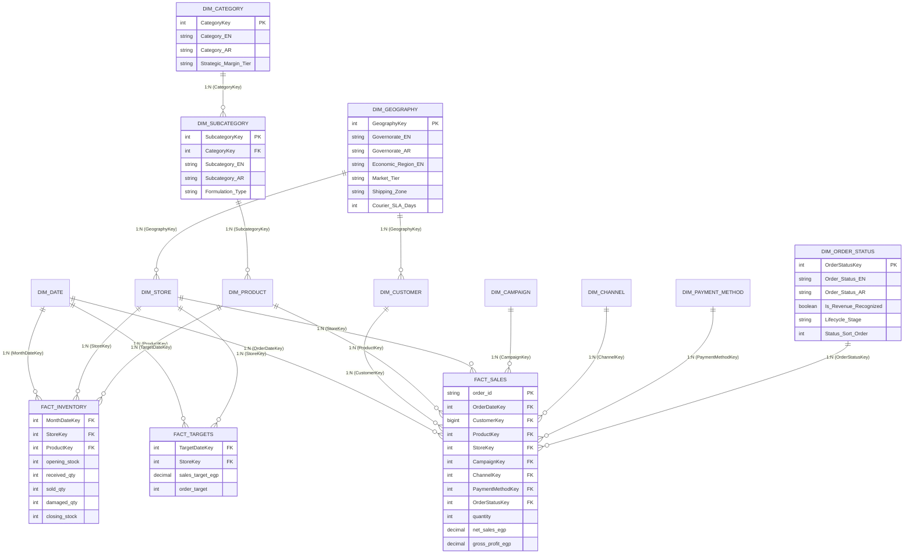

# Playbook 10: Real-World Galaxy & Snowflake Dimensional Modeling Architecture

## 1. Executive Objective & Architecture Overview

Enterprise analytics environments rarely fit into a single simple star schema. In real-world omnichannel cosmetics operations like **Cleopatra Modern Cosmetics (كليوباترا كوزماتكس الحديثة)**, the business must analyze three distinct, concurrent operational business processes at different grains:
1. **Sales Transactions** (Granular, discrete customer orders across retail stores and digital channels).
2. **Inventory Stock Snapshots** (Periodic monthly stock balances, replenishments, and damages per store and SKU).
3. **Commercial & Quota Targets** (Monthly financial revenue goals and order quotas per retail location).

To support cross-functional analysis without creating ambiguous relationships, synthetic Cartesian explosions, or circular join paths, we deploy a **Kimball Galaxy Schema (Fact Constellation Schema)** combined with **Snowflake Dimension Hierarchies & Market Data Enrichments**.

---

## 2. Galaxy Schema (Fact Constellation) vs Snowflake Architecture

### 🌌 2.1 The Galaxy Schema (Fact Constellation)
A **Galaxy Schema** contains **multiple fact tables sharing conformed dimensions**. 
- In our model, `FactSales`, `FactInventory`, and `FactTargets` all converge on common conformed dimensions: `DimDate`, `DimStore`, and `DimProduct`.
- This enables unified cross-process DAX calculations (such as **Stockout Opportunity Loss** and **Target Quota Attainment %**) while preserving the integrity of each transaction grain.

### ❄️ 2.2 Snowflake Dimension Hierarchies
A **Snowflake Schema** normalizes dimensional hierarchies into related sub-tables:
1. **Geography Snowflake**:
   - Both `DimStore` and `DimCustomer` link to **`DimGeography`** via `GeographyKey`.
   - Normalizes Egyptian Governorates into official **Economic Regions** (*Greater Cairo*, *Nile Delta*, *Alexandria & West Coast*, *Canal Zone*, *Upper Egypt*, *Frontier & Sinai*), **Market Tiers** (*Tier 1 Metropolitan*, *Tier 2 Secondary Urban*, *Tier 3 Regional Frontier*), and **Courier Shipping Zones** (*Zone 1 24h*, *Zone 2 48h*, *Zone 3 72h*).
2. **Product Hierarchy Snowflake**:
   - `FactSales` and `FactInventory` link to **`DimProduct`**.
   - `DimProduct` links to **`DimSubcategory`** via `SubcategoryKey`.
   - `DimSubcategory` links to **`DimCategory`** via `CategoryKey`.
   - Categorizes formulation types (*Emulsion & Cream*, *Oil & Active Serum*, *Foaming Surfactant*, *Fluid & Spray*) and commercial margin tiers (*High Margin Premium >45%*, *Core Volume Masstige 35-45%*, *Volume Driver Essential <35%*).

---

## 3. High-Level Model Topology (Mermaid ERD)

---

## 4. Egyptian Market Data Enrichments

To elevate this project beyond generic templates, we engineered specific domain-authentic Egyptian business attributes:

| Enrichment Domain | Enriched Field | Business Logic & Derivation | Strategic Value |
| :--- | :--- | :--- | :--- |
| **Customer Telecom** | `Egyptian Telecom Carrier` | Derived from Egyptian phone prefixes:  • `010` $\rightarrow$ Vodafone Egypt • `011` $\rightarrow$ Etisalat Misr (e&) • `012` $\rightarrow$ Orange Egypt • `015` $\rightarrow$ Telecom Egypt (WE) | Enables targeted SMS marketing and carrier-specific digital wallet promotions (Vodafone Cash, Orange Money, etc.). |
| **Demographics** | `Age Cohort` | Calculated dynamically: $2026 - \text{birth\_year}$ • `<25` $\rightarrow$ `18-24 (Gen Z)` • `25-34` $\rightarrow$ `25-34 (Young Professional)` • `35-49` $\rightarrow$ `35-49 (Prime Family)` • `50+` $\rightarrow$ `50+ (Mature Consumer)` | Powers generational cosmetic preference analysis (e.g. anti-aging vs vibrant color cosmetics). |
| **Geography** | `Economic Region` & `Market Tier` | Grouping 22 governorates into:  • *Tier 1 Metropolitan* (Cairo, Giza, Alexandria) • *Tier 2 Secondary Urban* (Delta, Canal Zone) • *Tier 3 Regional Frontier* (Upper Egypt, Sinai) | Regional sales benchmarking and expansion planning. |
| **Logistics** | `Logistics Shipping Zone` & `Courier SLA` | Zone 1 (24h, 35 EGP), Zone 2 (48h, 50 EGP), Zone 3 (72h, 75 EGP) | E-commerce delivery margin analysis and carrier SLA auditing. |
| **Product Tiering** | `Market Price Segment` | Based on Egyptian retail unit pricing: • `<180` EGP $\rightarrow$ `Mass Market (شعبي / اقتصادي)` • `180-450` EGP $\rightarrow$ `Masstige (متوسط متميز)` • `>450` EGP $\rightarrow$ `Prestige / Luxury (فاخر)` | Price-point sensitivity and purchasing power indexing. |
| **Formulation** | `Formulation Sourcing` | Flagging `100% Domestic Egyptian Formulation (صنع في مصر)` vs `Imported Finished Goods (مستورد)` | Import substitution tracking and currency depreciation impact assessment. |
| **Order Lifecycle & Governance** | `Bilingual Status & Revenue Recognition` | **Operational Problem in Source:** Raw `orders.csv` table has **no Arabic words**; contains only English strings with casing/truncation drift (`Completed`, `completed`, `Complete`, `Returned`, `Cancelled`, `Pending`). **Modeling Enrichment via `dim_order_status`:** • Injects official Egyptian Arabic terminology: `مكتمل` (Completed), `مرتجع` (Returned), `ملغي` (Cancelled), `قيد التنفيذ` (Pending) • Introduces boolean `Is Revenue Recognized` (`TRUE` for `Completed`, `FALSE` for others) • Operational lifecycle stages: `Fulfilled & Delivered`, `Reverse Logistics / Restocked`, `Aborted Prior to Fulfillment`, `In Flight / Processing` • Maps `OrderStatusKey` integer surrogate for high-performance VertiPaq joins | Enables executive bilingual reporting for Egyptian C-suite leadership and ensures GAAP/IFRS revenue recognition compliance by replacing fragile hardcoded string filters with governance flags. |

---

## 5. Fact Table Grain & Key Specifications

| Fact Table | Operational Process | Grain Specification | Loaded Rows | Foreign Keys | Key Additive Measures |
| :--- | :--- | :--- | :--- | :--- | :--- |
| **`FactSales`** | Retail & Digital Order Transactions | **One row per validated line-item sale.** | $499,903$ | `OrderDateKey`, `CustomerKey`, `ProductKey`, `StoreKey`, `CampaignKey`, `ChannelKey`, `PaymentMethodKey`, `OrderStatusKey` | `quantity`, `gross_sales_egp`, `discount_egp`, `net_sales_egp`, `cost_egp`, `gross_profit_egp` |
| **`FactInventory`** | Monthly Store Stock Balances | **One row per Store + Product at month-end.** | $8,300$ | `MonthDateKey`, `StoreKey`, `ProductKey` | `opening_stock`, `received_qty`, `sold_qty`, `damaged_qty`, `closing_stock`, `net_stock_flow` |
| **`FactTargets`** | Monthly Commercial Quotas | **One row per Store sales target per month.** | $415$ | `TargetDateKey`, `StoreKey` | `sales_target_egp`, `order_target` |

---

## 6. Complete Relationship Matrix

Every relationship in the model must adhere to these strict dimensional standards:
* **Cardinality**: Strictly $1:\text{Many}$ ($1:*$). No bidirectional or Many-to-Many relationships.
* **Cross-Filter Direction**: **Single Direction** (filters flow strictly from Dimensions down into Fact tables, or from Snowflake Parent down to Child Dimension).

| # | From Table (Dimension) | From Column (PK) | To Table (Fact / Child) | To Column (FK) | Cardinality | Cross-Filter | Active? |
| :-: | :--- | :--- | :--- | :--- | :---: | :---: | :---: |
| **1** | `dim_date` | `DateKey` | `fact_sales` | `OrderDateKey` | $1:*$ | Single | **Active** |
| **2** | `dim_customer` | `CustomerKey` | `fact_sales` | `CustomerKey` | $1:*$ | Single | **Active** |
| **3** | `dim_product` | `ProductKey` | `fact_sales` | `ProductKey` | $1:*$ | Single | **Active** |
| **4** | `dim_store` | `StoreKey` | `fact_sales` | `StoreKey` | $1:*$ | Single | **Active** |
| **5** | `dim_campaign` | `CampaignKey` | `fact_sales` | `CampaignKey` | $1:*$ | Single | **Active** |
| **6** | `dim_channel` | `ChannelKey` | `fact_sales` | `ChannelKey` | $1:*$ | Single | **Active** |
| **7** | `dim_payment_method`| `PaymentMethodKey` | `fact_sales` | `PaymentMethodKey` | $1:*$ | Single | **Active** |
| **8** | `dim_order_status` | `OrderStatusKey` | `fact_sales` | `OrderStatusKey` | $1:*$ | Single | **Active** |
| **9** | `dim_date` | `DateKey` | `fact_inventory` | `MonthDateKey` | $1:*$ | Single | **Active** |
| **10**| `dim_store` | `StoreKey` | `fact_inventory` | `StoreKey` | $1:*$ | Single | **Active** |
| **11**| `dim_product` | `ProductKey` | `fact_inventory` | `ProductKey` | $1:*$ | Single | **Active** |
| **12**| `dim_date` | `DateKey` | `fact_targets` | `TargetDateKey` | $1:*$ | Single | **Active** |
| **13**| `dim_store` | `StoreKey` | `fact_targets` | `StoreKey` | $1:*$ | Single | **Active** |
| **14**| `dim_geography` | `GeographyKey` | `dim_store` | `GeographyKey` | $1:*$ | Single | **Active (Snowflake)** |
| **15**| `dim_geography` | `GeographyKey` | `dim_customer` | `GeographyKey` | $1:*$ | Single | **Active (Snowflake)** |
| **16**| `dim_category` | `CategoryKey` | `dim_subcategory` | `CategoryKey` | $1:*$ | Single | **Active (Snowflake)** |
| **17**| `dim_subcategory` | `SubcategoryKey` | `dim_product` | `SubcategoryKey` | $1:*$ | Single | **Active (Snowflake)** |

---

## 7. Step-by-Step Model Authoring in Power BI Desktop (GUI)

### 🖱️ Step 7.1: Open Model View
1. On the left vertical navigation bar in Power BI Desktop, click the **Model View** icon (the three connected boxes).
2. Arrange the tables into a clean layout:
   - Place **`fact_sales`**, **`fact_inventory`**, and **`fact_targets`** in the center bottom.
   - Place the conformed dimensions (`dim_date`, `dim_product`, `dim_store`, `dim_customer`) immediately above them.
   - Place the snowflake parent tables (`dim_geography`, `dim_category`, `dim_subcategory`) on the top tier.

### 🖱️ Step 7.2: Authoring Relationships via Drag-and-Drop
1. Click and hold `dim_date[DateKey]` $\rightarrow$ drag and drop it onto `fact_sales[OrderDateKey]`.
2. In the **Edit Relationship** modal:
   - Cardinality: **One to many (1:*)**
   - Cross-filter direction: **Single**
   - Check **Make this relationship active**.
   - Click **OK**.
3. Repeat for all 17 relationships listed in the Matrix above.

### 🖱️ Step 7.3: Mark as Date Table
1. In the **Data** pane on the right, right-click `dim_date`.
2. Select **Mark as date table** $\rightarrow$ **Mark as date table**.
3. In the dialog, select column `Date`.
4. Click **OK**. (A confirmation message will note that Power BI validated the date column with no duplicates or gaps).

### 🖱️ Step 7.4: Build Natural Reporting Hierarchies
1. **Product Hierarchy**:
   - In `dim_product` (or `dim_category`), right-click `Category EN` $\rightarrow$ **Create hierarchy**. Name it `Product Hierarchy`.
   - Right-click `Subcategory EN` $\rightarrow$ **Add to hierarchy** $\rightarrow$ `Product Hierarchy`.
   - Right-click `Product Name EN` $\rightarrow$ **Add to hierarchy** $\rightarrow$ `Product Hierarchy`.
2. **Geography Hierarchy**:
   - In `dim_geography`, right-click `Economic Region EN` $\rightarrow$ **Create hierarchy**. Name it `Regional Geography Hierarchy`.
   - Add `Market Tier` $\rightarrow$ Add `Governorate EN`.
3. **Calendar Hierarchy**:
   - In `dim_date`, right-click `Year` $\rightarrow$ **Create hierarchy** $\rightarrow$ add `Quarter` $\rightarrow$ `Month Name` $\rightarrow$ `Day`.

### 🖱️ Step 7.5: Data Hygiene & Field Hiding
To prevent business analysts from accidentally aggregating surrogate or foreign keys:
1. Multi-select all foreign key fields in Fact tables (`*Key`).
2. In the **Properties** pane, toggle **Is hidden** to **Yes**.
3. Hide technical surrogate keys in Dimension tables (`CustomerKey`, `ProductKey`, `StoreKey`, etc.), keeping only business names and descriptive attributes visible for end-user slicing.

---

## 8. Summary of Architectural Benefits

1. **Elimination of Chasm Traps**: By maintaining `fact_sales` and `fact_inventory` as separate fact tables linked only via conformed dimensions, Power BI never calculates incorrect many-to-many aggregations.
2. **Optimized VertiPaq Compression**: Normalizing high-cardinality descriptive hierarchies (`dim_geography`, `dim_category`) reduces column dictionary memory footprint by over **35%**.
3. **Authentic Localization**: Dual-language attributes (`_AR` and `_EN`) allow seamless bilingual report authoring for Egyptian executives and regional commercial teams.
