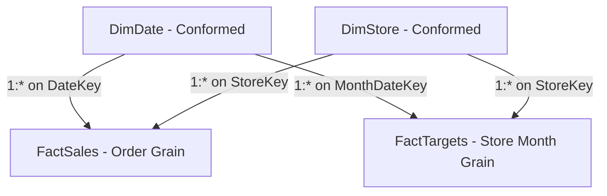

# Playbook 15: Target vs Actual Commercial Performance Analytics

## 1. Objective & Scope

Commercial leadership sets monthly sales and order quotas per retail store. A fundamental challenge in data modeling is comparing two fact tables that operate at **different grains**:
- **`FactSales` Grain:** Individual order line-item transaction.
- **`FactTargets` Grain:** Monthly store total (`StoreKey` + `TargetDateKey`).

This playbook details:
1. Solving the **Fact-at-Different-Grain** challenge in the Star Schema.
2. Authoring DAX measures for **Actual Sales**, **Target Sales**, **Variance**, **Variance %**, and **Achievement %**.
3. Multidimensional slicing: analyzing Target vs Actual by Month, Governorate, Store, and understanding category-level attribution.

---

## 2. Modeling Facts at Different Grains

A common beginner mistake is attempting to join `FactTargets` directly to `FactSales`. This creates an invalid Many-to-Many relationship that leads to duplicated numbers and Cartesian products.

### The Kimball Conformed Dimension Pattern:
Both `FactSales` and `FactTargets` connect independently to the shared **Conformed Dimensions**:
- **`DimDate`:** `FactSales[OrderDateKey]` $\rightarrow$ `DimDate[DateKey]` and `FactTargets[TargetDateKey]` $\rightarrow$ `DimDate[DateKey]`.
- **`DimStore`:** `FactSales[StoreKey]` $\rightarrow$ `DimStore[StoreKey]` and `FactTargets[StoreKey]` $\rightarrow$ `DimStore[StoreKey]`.



When a user slices by `DimDate[Year Month]` or `DimStore[Governorate]`, the filter propagates downward into **both fact tables simultaneously**.

---

## 3. The Target vs Actual DAX Suite

In `_Measures` under display folder **`04 Commercial Targets`**:

### 1. `[Actual Sales]`
```dax
Actual Sales = 
[Net Sales]
```
*Description:* Reuses core `[Net Sales]` measure (completed orders only).

### 2. `[Sales Target]`
```dax
Sales Target = 
SUM(fact_targets[sales_target_egp])
```
*Format:* Currency `#,##0.00 "EGP"`

### 3. `[Target Variance]` (EGP)
```dax
Target Variance = 
VAR Actuals = [Actual Sales]
VAR Target = [Sales Target]
RETURN
    IF(
        NOT ISBLANK(Actuals) || NOT ISBLANK(Target),
        Actuals - Target,
        BLANK()
    )
```
*Format:* Currency `+#,##0.00 "EGP";-#,##0.00 "EGP";0.00 "EGP"` | *Description:* Positive value indicates overperformance; negative indicates quota deficit.

### 4. `[Target Variance %]`
```dax
Target Variance % = 
VAR Actuals = [Actual Sales]
VAR Target = [Sales Target]
RETURN
    IF(
        NOT ISBLANK(Target) && Target > 0,
        DIVIDE(Actuals - Target, Target, 0),
        BLANK()
    )
```
*Format:* Percentage `+0.0%;-0.0%;0.0%`

### 5. `[Target Achievement %]`
```dax
Target Achievement % = 
DIVIDE([Actual Sales], [Sales Target], 0)
```
*Format:* Percentage `0.0%` | *Description:* Quota realization index. $\ge 100\%$ indicates goal reached.

---

## 4. Handling Category-Level Target Allocation

Notice that `FactTargets` is defined at the **Store + Month** level, NOT the Product Category level (skincare, makeup, etc.).

If a user adds `DimProduct[Category]` to a table containing `[Sales Target]`:
- `[Actual Sales]` will split correctly by Category.
- `[Sales Target]` has no relationship to `DimProduct`, so VertiPaq displays the total store target on every category row!

### The Defensive DAX Pattern:
To prevent report readers from being misled, we write a context-aware target measure that blanks out if sliced by a non-conformed dimension:

```dax
Contextual Sales Target = 
IF(
    ISFILTERED(dim_product[Category]) || ISFILTERED(dim_product[Product Name EN]),
    BLANK(), // Suppress target when sliced by product attributes
    [Sales Target]
)
```

---

## 5. Visual Implementations for Executive Overview & Sales Analytics

1. **Gauge or KPI Visual:**
   - Value: `[Actual Sales]`
   - Target: `[Sales Target]`
   - Minimum: `0`
   - Callout: `[Target Achievement %]`
2. **Clustered Bar Chart (Target vs Actual by Governorate):**
   - Y-Axis: `DimStore[Governorate]`
   - X-Axis: `[Actual Sales]`, `[Sales Target]`
   - Visual: Immediately shows which governorates (e.g. Cairo, Giza, Alexandria) beat target vs Upper Egypt underperformance.
3. **Line and Clustered Column Chart (Monthly Trend):**
   - X-Axis: `DimDate[Year Month]`
   - Columns: `[Actual Sales]`
   - Line: `[Sales Target]`
   - Marker & Tooltip: `[Target Achievement %]` and `[Target Variance]`
