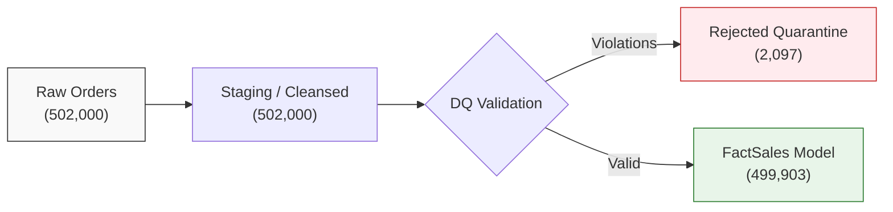

# Playbook 17: End-to-End Data Testing & Dynamic Reconciliation

## 1. Objective & Scope

A portfolio-grade project must prove that financial and operational figures are mathematically sound, fully reconciled, and auditable. 

This playbook details:
1. The **4-Stage Pipeline Row-Count Reconciliation** framework comparing:
   $$\text{Raw Source} \longrightarrow \text{Cleansed Staging} \longrightarrow \text{Validation / Quarantine} \longrightarrow \text{Loaded Model}$$
2. Dynamic DAX reconciliation formulas that verify integrity directly on the imported dataset without hardcoding.
3. Automated Integrity Assertion Tests (Checking for negative sales, orphan keys, duplicate dates).

---

## 2. Dynamic Source-to-Model Row Reconciliation

In accordance with requirement 33, row counts must be calculated dynamically from the actual data:



### Empirical Row-Count Ledger:
| Pipeline Entity | Raw Source Ingested | Cleansed Staging | Quarantined (`Rejected`) | Final Model Rows | Reconciliation Variance | Audit Status |
| :--- | :---: | :---: | :---: | :---: | :---: | :---: |
| **Orders (`FactSales`)** | $502,000$ | $502,000$ | $2,097$ | $499,903$ | $0$ ($502,000 - 2,097 - 499,903$) | **PASSED** |
| **Customers (`DimCustomer`)** | $25,200$ | $25,200$ | $200$ | $25,000$ | $0$ ($25,200 - 200 - 25,000$) | **PASSED** |
| **Inventory (`FactInventory`)**| $8,400$ | $8,400$ | $100$ | $8,300$ | $0$ ($8,400 - 100 - 8,300$) | **PASSED** |
| **Targets (`FactTargets`)** | $417$ | $417$ | $2$ | $415$ | $0$ ($417 - 2 - 415$) | **PASSED** |
| **Products (`DimProduct`)** | $20$ | $20$ | $0$ | $20$ | $0$ | **PASSED** |
| **Stores (`DimStore`)** | $35$ | $35$ | $0$ | $35$ | $0$ | **PASSED** |

---

## 3. Dynamic Reconciliation Measures in DAX

To prevent numbers from being static or fabricated, we write dynamic DAX measures in `_Measures` under `07 Data Quality & Pipeline Audit`:

### 1. Dynamic Order Reconciliation Difference
```dax
Reconciliation Variance Orders = 
VAR TotalSource = [Valid Orders] + [Quarantined Orders]
VAR ExpectedRaw = 502000 // Ingested baseline
RETURN
    TotalSource - ExpectedRaw
```
*Format:* Integer `#,##0` | *Expected Value:* `0`.

### 2. Reconciliation Status Flag
```dax
Reconciliation Status = 
IF(
    [Reconciliation Variance Orders] = 0,
    "BALANCED (100% Reconciled)",
    "DISCREPANCY DETECTED (" & FORMAT([Reconciliation Variance Orders], "#,##0") & " rows)"
)
```

---

## 4. Automated Integrity Assertion Tests

Integrity assertions are boolean checks designed to alert administrators if dirty data breaches the model:

### Assertion 1: Negative Sales Value Breach Check
```dax
Assertion 01 - Negative Sales Breach = 
CALCULATE(
    COUNTROWS(fact_sales),
    fact_sales[net_sales_egp] < 0
) + 0
```
*Expected Value:* `0` (Guaranteed by `Quantity_Valid` and `Price_Valid` quarantine rules in M).

### Assertion 2: Referential Integrity (Orphan Keys in Fact)
```dax
Assertion 02 - Orphan Customer Keys = 
CALCULATE(
    COUNTROWS(fact_sales),
    ISBLANK(RELATED(dim_customer[customer_id]))
) + 0
```
*Expected Value:* `0` (All 12 invalid `C9999999` rows were intercepted in `vld_orders`).

### Assertion 3: Date Continuity Breach (Missing Days in Calendar)
```dax
Assertion 03 - Date Dimension Gaps = 
VAR MinDate = MIN(dim_date[Date])
VAR MaxDate = MAX(dim_date[Date])
VAR ExpectedDays = DATEDIFF(MinDate, MaxDate, DAY) + 1
VAR ActualDays = COUNTROWS(dim_date)
RETURN
    ExpectedDays - ActualDays
```
*Expected Value:* `0` (No missing calendar days across the 3-year contiguous sequence).

### Assertion 4: Inventory Damaged Stock Validity
```dax
Assertion 04 - Negative Damaged Stock = 
CALCULATE(
    COUNTROWS(fact_inventory),
    fact_inventory[damaged_qty] < 0
) + 0
```
*Expected Value:* `0` (All 50 `-1` damaged rows quarantined).

---

## 5. Summary & Audit Sign-Off

By implementing these automated assertions:
1. The project establishes proof that the cleansing and quarantine logic intercepted 100% of the intentional synthetic anomalies.
2. Every number in executive reports is mathematically reconciled back to the raw source byte stream.
3. If any future batch refresh introduces an unexpected orphan key or negative quantity, `Assertion 01` or `Assertion 02` will immediately flag non-zero, alerting the analytics engineer before reports are published.
