# Data Lifecycle Architecture: Egyptian Cosmetics Analytics in Power BI

## 1. Executive Summary & Philosophy

In modern enterprise business intelligence, a common misconception is that Power BI is merely a visualization tool ("data paint"). This project, **Egyptian Cosmetics Analytics**, demonstrates the contrary: Power BI is an end-to-end Analytics Engineering platform capable of governing the entire data lifecycle.

The enterprise scenario is **Cleopatra Modern Cosmetics (كليوباترا كوزماتكس الحديثة)**, an Egyptian multi-channel beauty retailer. Raw operational data arrives from multiple heterogeneous, uncoordinated source systems:
1. Operational PostgreSQL database dumps (Orders, Customers, Stores, Products)
2. Commercial Excel workbooks (Sales Targets, Marketing Campaigns, Store Reference Data)
3. Monthly warehouse inventory CSV logs
4. Daily currency exchange rates published via a REST-like JSON endpoint

The source files contain realistic, intentional operational anomalies: duplicate keys, near-duplicate customer records, broken foreign keys, invalid quantities/prices, date drift (1900-01-01 and future dates), currency formatting variations (`EGP`, `EGP `, `جنيه`, `جنيه مصري`), and bilingual attribute drift.

Rather than relying on external preprocessing (Python, SQL Server, dbt), **Power BI owns every stage of the data lifecycle**.

---

## 2. The 15-Stage Data Lifecycle Diagram

```mermaid
flowchart TD
    subgraph S1["Stage 1: SOURCE"]
        A1[PostgreSQL CSVs]
        A2[Commercial Excel Workbook]
        A3[Warehouse Inventory CSV]
        A4[Exchange Rates JSON]
    end

    subgraph S2["Stage 2: CONNECT & INGEST"]
        B1["Power Query Source Connectors\n(Csv.Document, Excel.Workbook, Json.Document)"]
        B2["Dynamic Parameterization\n(pRawDataPath, pStartDate, pEndDate)"]
    end

    subgraph S3["Stage 3: PROFILE & UNDERSTAND"]
        C1["Data Profiling Engine\n(Column Quality, Distribution, Profile, Value Counts)"]
        C2["Empirical Defect Cataloging\n(2,000 Order Dups, 35 Negative Qty, 35 Broken FKs)"]
    end

    subgraph S4["Stage 4: STAGE & DECOUPLE"]
        D1["02_Staging Layer\n(Raw Ingestion Decoupling, Enable Load = OFF)"]
    end

    subgraph S5["Stage 5: CLEAN & STANDARDIZE"]
        E1["Modular M Functions\n(fnCleanText, fnNormalizeCurrency, fnNormalizeStatus)"]
        E2["Text Normalization & Arabic/English Preservation"]
        E3["Locale-Aware Type Conversions"]
    end

    subgraph S6["Stage 6: VALIDATE & QUARANTINE"]
        F1["Multi-Rule Quality Evaluation\n(CustomerID_Valid, ProductID_Valid, Quantity_Valid, etc.)"]
        F2["DataQualityStatus Split:\nValid vs Rejected vs Warning"]
        F3["Quarantine Extraction\n(rejected_orders, rejected_customers, rejected_inventory)"]
    end

    subgraph S7["Stage 7: REFERENCE MAPPING"]
        G1["Lookup Tables\n(ref_currency, ref_status, ref_governorate, ref_channel, ref_payment)"]
        G2["Declarative Mapping Merges\n(Zero Hardcoded Nested IFs)"]
    end

    subgraph S8["Stage 8: TRANSFORM & ENRICH"]
        H1["ETL Business Logic in M\n(Gross Sales, Discount Amount, Net Sales, Cost, Margin)"]
        H2["Deterministic Customer Deduplication Strategy"]
    end

    subgraph S9["Stage 9: FACT & DIMENSION PREPARATION"]
        I1["Dimension Engineering\n(Surrogate Keys, Distinct Dimensions, Deduplicated Entities)"]
        I2["Fact Grain Modeling\n(FactSales, FactInventory, FactTargets)"]
        I3["Power Query DimDate Generation\n(365 Days/Yr, Fiscal & Calendar Attributes)"]
    end

    subgraph S10["Stage 10: DATA MODEL (TABULAR ENGINE)"]
        J1["Star Schema Implementation\n(1-to-Many, Single-Direction Cross-Filtering)"]
        J2["Surrogate Key Linkages\n(No Bi-directional / Many-to-Many Relationships)"]
    end

    subgraph S11["Stage 11: DAX SEMANTIC LAYER"]
        K1["Dedicated _Measures Table\n(Organized into 7 Display Folders)"]
        K2["Analytical Calculations & Time Intelligence\n(YTD, YoY, MoM, PY, QTD)"]
        K3["Customer Statistical RFM Segmentation"]
    end

    subgraph S12["Stage 12: ANALYZE & VISUALIZE"]
        L1["5 Enterprise Report Pages\n(Executive, Sales, Customer RFM, Inventory, DQ Cockpit)"]
        L2["Bilingual UX Support\n(Arabic & English Headers and Navigation)"]
    end

    subgraph S13["Stage 13: RECONCILE & AUDIT"]
        M1["Source-to-Model Row Reconciliation\n(502,000 Raw -> 2,097 Quarantined -> 499,903 Valid)"]
        M2["Continuous Refresh Validation Checklist"]
    end

    S1 --> S2 --> S3 --> S4 --> S5 --> S6 --> S7 --> S8 --> S9 --> S10 --> S11 --> S12 --> S13
```



---

## 3. Strict Separation of Concerns: M vs Data Model vs DAX

A foundational architectural requirement is knowing **where** a calculation or transformation belongs. Violating these boundaries causes refresh bottlenecks, memory bloat, or brittle DAX.

| Responsibility Layer | Technology | What Belongs Here | What DOES NOT Belong Here | Rationale |
| :--- | :--- | :--- | :--- | :--- |
| **Data Preparation & ETL** | **Power Query (M Engine)** | - Raw ingestion & file decoding<br>- Text cleaning & regex-like whitespace trimming<br>- Multi-column validation & quarantine routing<br>- Row-level row-count deduplication<br>- Reference mapping merges<br>- Row-level business metrics (Gross, Discount, Net, Cost)<br>- Surrogate key generation (`Table.AddIndexColumn`)<br>- Star schema dimension extraction | - Aggregations that depend on report filter context<br>- Dynamic time intelligence (e.g., dynamic YTD)<br>- Dynamic user currency conversion slicers<br>- Visual styling or chart formatting | M transforms data once at refresh time. Row-level calculations compressed by VertiPaq in M consume less RAM than DAX calculated columns. |
| **Relationship & Storage** | **VertiPaq Tabular Engine (Data Model)** | - Star schema topology ($1:\text{Many}$)<br>- Single-direction filter propagation<br>- Marking `DimDate` as Date Table<br>- Setting column data types and format strings<br>- Column sort-by configurations (e.g., Month Name sorted by Month Number)<br>- Hiding surrogate keys and foreign keys from report view | - Transforming text or cleaning errors<br>- Bidirectional cross-filtering without strict M:M bridge necessity<br>- Snowflake normalized chains | Clean star schemas maximize VertiPaq dictionary encoding, run-length encoding (RLE), and bit-packing compression. |
| **Analytical Semantic Layer** | **DAX (Data Analysis Expressions)** | - Dynamic aggregations (`SUM`, `DIVIDE`, `COUNTROWS`)<br>- Filter context modifiers (`CALCULATE`, `KEEPFILTERS`)<br>- Time Intelligence (`SAMEPERIODLASTYEAR`, `DATESYTD`)<br>- Dynamic RFM quantile ranking & classification<br>- Target vs Actual variance & achievement percentages<br>- KPI visual formatting strings | - Row-level data cleansing<br>- String splitting and text normalization<br>- Data quality quarantine extraction<br>- Building dimension tables via DAX calculated tables (unless strictly required) | DAX operates at query time in memory over VertiPaq column structures. DAX calculated columns execute during refresh but bypass M's compression pipeline and cannot be exported to quarantine. |

---

## 4. Query Dependency Architecture

To prevent circular dependencies and minimize redundant query executions during refresh, queries are segregated into 8 strictly ordered groups:

```
[01_Source]  (Load: False) -> Connects directly to files using pRawDataPath. Raw schema preserved.
     ↓
[02_Staging] (Load: False) -> Promotes headers, trims column names, establishes initial datatypes.
     ↓
[03_Reference] (Load: False) -> Static and dynamic lookup dimensions (Currencies, Governorates, Statuses).
     ↓
[04_Cleansed] (Load: False) -> Applies modular M cleaning functions (fnCleanText, fnNormalizeStatus).
     ↓
[05_Validated] (Load: False) -> Runs 17 Data Quality rules. Produces DataQualityStatus & DataQualityReason.
     ├──> [rejected_*] (Load: True) -> Quarantined invalid rows with error descriptions.
     └──> [vld_*]     (Load: False) -> Clean, valid records filtered to DataQualityStatus = "Valid".
     ↓
[06_Transformations] (Load: False) -> Computes Net Sales, Costs, and merges reference dimensions.
     ↓
[07_Model] (Load: True) -> Final Star Schema Dim and Fact tables loaded into the Tabular Model.
     ↓
[99_Admin] (Load: True) -> DQ Summary, Pipeline Metrics, and Refresh Audit tables.
```

---

## 5. Enterprise Architectural Summary

By enforcing this 15-stage lifecycle:
1. **Auditable Lineage:** Every single number in the Executive Overview can be traced directly back through the dimensional model, validated subset, cleansed staging, and raw CSV.
2. **Operational Resilience:** When bad data enters the raw files (e.g. negative prices or future dates), the pipeline does not break. Invalid rows are automatically quarantined to audit tables, alerting operations without corrupting executive financial KPIs.
3. **High VertiPaq Compression:** Because high-cardinality noise, whitespace, and invalid keys are eradicated in M, VertiPaq achieves optimal dictionary encoding and blazing fast sub-second DAX query response times.
