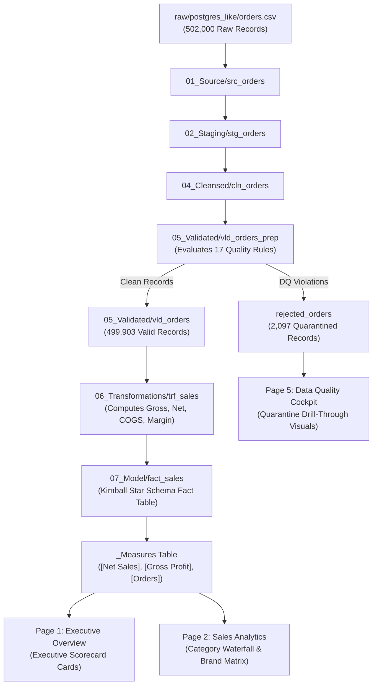

# Data Lineage Architecture: End-to-End Traceability Matrix

## 1. Objective & Scope

In enterprise data governance and analytics engineering, **Data Lineage** provides the unbroken audit trail connecting every raw source file to its downstream business visual.

This document details the end-to-end data lineage for Cleopatra Modern Cosmetics, tracking:
$$\text{Raw Source File} \longrightarrow \text{Source Query} \longrightarrow \text{Staging Query} \longrightarrow \text{Cleansed Query} \longrightarrow \text{Validation / Quarantine} \longrightarrow \text{Transformation} \longrightarrow \text{Model Entity} \longrightarrow \text{Report Page Usage}$$

---

## 2. Comprehensive Enterprise Lineage Matrix

| Raw Source File | Source Query (`01_Source`) | Staging Query (`02_Staging`) | Cleansed Query (`04_Cleansed`) | Validated Query (`05_Validated`) | Transformation Query (`06_Transformations`) | Final Model Table (`07_Model`) | Primary Report Page Usage |
| :--- | :--- | :--- | :--- | :--- | :--- | :--- | :--- |
| `raw/postgres_like/orders.csv` ($502,000$ rows) | `src_orders` | `stg_orders` | `cln_orders` | `vld_orders_prep` $\rightarrow$ `vld_orders` $\rightarrow$ `rejected_orders` | `trf_sales` | `fact_sales` ($499,903$ rows) `rejected_orders` ($2,097$ rows) | **Page 1:** Executive Overview (Net Sales, Profit, AOV) **Page 2:** Sales Analytics (Product, Brand, Channel) **Page 5:** DQ Dashboard (Quarantine Audit) |
| `raw/postgres_like/customers.csv` ($25,200$ rows) | `src_customers` | `stg_customers` | `cln_customers` | `vld_customers_prep` $\rightarrow$ `vld_customers` $\rightarrow$ `rejected_customers` | `trf_customer` | `dim_customer` ($25,000$ rows) `rejected_customers` ($200$ rows) `customer_duplicate_analysis` | **Page 1:** Executive Overview (Customer Count) **Page 3:** Customer Analytics (RFM Segments, LTV) **Page 5:** DQ Dashboard (Duplicate Analysis) |
| `raw/postgres_like/products.csv` ($20$ rows) | `src_products` | `stg_products` | `cln_products` | Integrated with Orders / Inventory | `trf_product` | `dim_product` ($20$ rows) | **Page 1:** Executive Overview (Top Products) **Page 2:** Sales Analytics (Category, Margin %) **Page 4:** Inventory (SKU Details) |
| `raw/postgres_like/stores.csv` ($35$ rows) | `src_stores` | `stg_stores` | `cln_stores` | Integrated with Orders / Targets | `trf_store` | `dim_store` ($35$ rows) | **Page 1:** Executive Overview (Gov Sales) **Page 2:** Sales Analytics (Store Formats) **Page 4:** Inventory (Store Balance) |
| `raw/excel/commercial_reference_data.xlsx` $\rightarrow$ `Targets` ($417$ rows) | `src_excel_workbook` $\rightarrow$ `src_targets` | `stg_targets` | `cln_targets` | `vld_targets` $\rightarrow$ `rejected_targets` | `trf_targets` | `fact_targets` ($415$ rows) `rejected_targets` ($2$ rows) | **Page 1:** Executive Overview (Target %) **Page 2:** Sales Analytics (Variance EGP) |
| `raw/excel/commercial_reference_data.xlsx` $\rightarrow$ `Campaigns` ($7$ rows) | `src_excel_workbook` $\rightarrow$ `src_campaigns` | `stg_campaigns` | `cln_campaigns` | Validated in Staging | Direct to Model | `dim_campaign` ($7$ rows) | **Page 1:** Executive Overview (Campaign ROI) **Page 2:** Sales Analytics (Platform Split) |
| `raw/csv/inventory_monthly.csv` ($8,400$ rows) | `src_inventory` | `stg_inventory` | `cln_inventory` | `vld_inventory_prep` $\rightarrow$ `vld_inventory` $\rightarrow$ `rejected_inventory` | `trf_inventory` | `fact_inventory` ($8,300$ rows) `rejected_inventory` ($100$ rows) | **Page 4:** Inventory Analytics (Stockout Risk, Low Stock, Damaged Losses) |
| `raw/api/exchange_rates.json` ($730$ rows) | `src_exchange_rates` | `stg_exchange_rates` | `cln_exchange_rates`| Standardized | Direct to Reference | `ref_currency_mapping` | Reference currency conversion for imported cosmetics lines |
| Generated M Calendar Script | N/A (Generated in M) | N/A | N/A | Contiguous Assertion Validated | Chronological Attributes | `dim_date` ($1,096$ days) | Filter Context across all report pages; Time Intelligence (YTD, YoY, MoM) |

---

## 3. Visual Lineage Diagram: Orders to Report Visuals

---

## 4. Governance & Impact Analysis

Because this lineage is strictly enforced through modular query references:
1. **Upstream Schema Drift:** If `orders.csv` changes column name from `unit_price_egp` to `price`, the fix is applied once in `stg_orders`. Every downstream query (`cln_orders`, `vld_orders`, `trf_sales`, `fact_sales`) automatically inherits the fix without breaking visual bindings.
2. **Regulatory & Financial Auditability:** During internal or external financial audits, Cleopatra Cosmetics can demonstrate that every EGP of recognized revenue on Page 1 originated from a physically delivered, verified order in `fact_sales`, with all duplicate transactions and negative prices quarantined and audited in `rejected_orders`.
