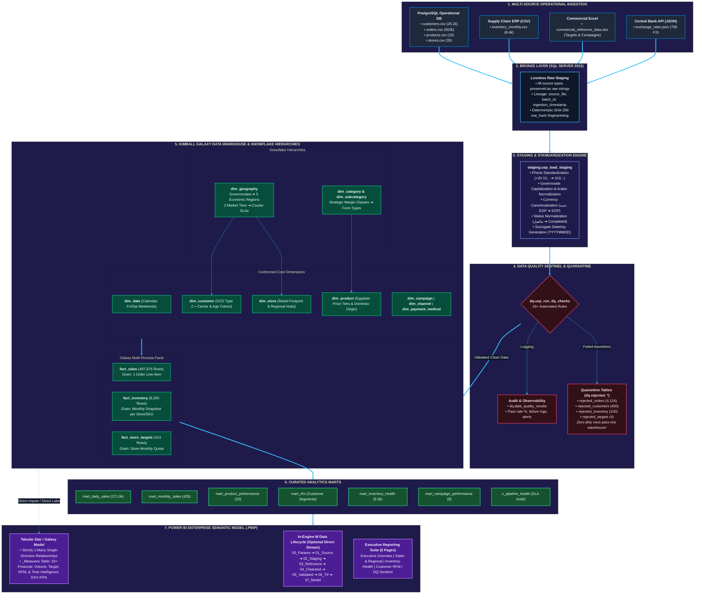

# Cleopatra Modern Cosmetics — Complete Project Lifecycle Architecture

This document presents the full, end-to-end analytics engineering and Power BI data lifecycle for **Cleopatra Modern Cosmetics (كليوباترا كوزماتكس الحديثة)**. It illustrates how raw, heterogeneous operational data flows through ingestion, automated data quality quarantining, Kimball Galaxy dimensional modeling, curated business marts, and executive Power BI reporting.

---

## 1. High-Resolution Visual Architecture Diagram


> [!TIP]
> **Vector SVG & Excalidraw Formats:**
> * 🎨 **Vector SVG (Lossless Zoom)**: [project_lifecycle.svg](file:///d:/courses/Data%20Science/Data%20Engineering/Projects/egyptian_cosmetics_market/docs/diagrams/project_lifecycle.svg)
> * ✏️ **Editable Excalidraw Board**: [project_lifecycle.excalidraw](file:///d:/courses/Data%20Science/Data%20Engineering/Projects/egyptian_cosmetics_market/docs/diagrams/project_lifecycle.excalidraw)

---

## 2. Interactive Mermaid Architecture Flowchart



---

## 2. Excalidraw-Style Hand-Drawn Schematic Visual

```text
┌──────────────────────────────────────────────────────────────────────────────────────────────────────────────────┐
│                               CLEOPATRA MODERN COSMETICS — DATA PLATFORM LIFECYCLE                               │
└──────────────────────────────────────────────────────────────────────────────────────────────────────────────────┘

 [1. OPERATIONAL SOURCES]
 ┌──────────────────────┐  ┌──────────────────────┐  ┌──────────────────────┐  ┌──────────────────────┐
 │ PostgreSQL Store DB  │  │   Supply Chain ERP   │  │   Commercial Excel   │  │   Central Bank API   │
 │ • customers.csv      │  │ • inventory_monthly  │  │ • Targets sheet      │  │ • exchange_rates     │
 │ • orders.csv         │  │   (8,400 monthly rows│  │ • Campaigns sheet    │  │   (730 daily FX rates│
 │ • products.csv       │  │    balance snapshot) │  │   (Commercial quotas)│  │    USD/EUR to EGP)   │
 └──────────┬───────────┘  └──────────┬───────────┘  └──────────┬───────────┘  └──────────┬───────────┘
            │                         │                         │                         │
            ▼                         ▼                         ▼                         ▼
 ┌────────────────────────────────────────────────────────────────────────────────────────────────────┐
 │ [2. BRONZE LOSSLESS STORAGE] (SQL Server 2022 / Fabric OneLake)                                    │
 │ • Exact raw string mirror • Audit metadata (source_file, ingestion_time, batch_id, SHA-256 hash)   │
 └─────────────────────────────────────────────────┬──────────────────────────────────────────────────┘
                                                   │
                                                   ▼
 ┌────────────────────────────────────────────────────────────────────────────────────────────────────┐
 │ [3. STAGING & STANDARDIZATION]                                                                     │
 │ • Phone Cleanup: '+20 10...' ➔ '010...' (11-digit local)    • Text Trim & Non-Printable Clean      │
 │ • Governorate Mapping: 'cairo' ➔ 'Cairo'                    • Currency Coercion: 'جنيه' ➔ 'EGP'    │
 │ • Status Normalization: 'مكتمل' ➔ 'Completed'               • Surrogate Date Keys (YYYYMMDD)       │
 └─────────────────────────────────────────────────┬──────────────────────────────────────────────────┘
                                                   │
                                                   ▼
 ┌────────────────────────────────────────────────────────────────────────────────────────────────────┐
 │ [4. DATA QUALITY GATEWAY & AUTOMATED QUARANTINE]                                                   │
 │ • 16+ Assertions: NotNull, Unique, Referential Integrity, Math Equation, Positive Quantities       │
 └──────────────────────┬──────────────────────────────────────────────────────┬──────────────────────┘
                        │ (Violations Detected)                                │ (Passed 100% Clean)
                        ▼                                                      ▼
 ┌──────────────────────────────────────────────┐       ┌─────────────────────────────────────────────┐
 │ QUARANTINE TABLES (Never Lost / Never Dropped│       │ [5. KIMBALL GALAXY DATA WAREHOUSE]          │
 │ • dq.rejected_orders      : 4,124 rows       │       │ ┌─────────────────────────────────────────┐ │
 │ • dq.rejected_customers   :   400 rows       │       │ │ SNOWFLAKE HIERARCHIES:                  │ │
 │ • dq.rejected_inventory   :   100 rows       │       │ │ • dim_geography (5 Regions, 3 Tiers)    │ │
 │ • dq.rejected_targets     :     4 rows       │       │ │ • dim_category & dim_subcategory        │ │
 │ Ledger: dq.data_quality_results              │       │ └────────────────────┬────────────────────┘ │
 └──────────────────────────────────────────────┘                              │                      │
                                                                               ▼                      │
                                                        ┌───────────────────────────────────────────┐ │
                                                        │ CONFORMED CORE DIMENSIONS:                │ │
                                                        │ • dim_date     (Calendar, Fri/Sat Weekend)│ │
                                                        │ • dim_customer (SCD Type 2 + Telecom/Age) │ │
                                                        │ • dim_product  (Price Tiers + Domestic)   │ │
                                                        │ • dim_store    (Footprint Class + Hubs)   │ │
                                                        │ • dim_campaign | dim_channel | dim_payment│ │
                                                        └──────────────────────┬────────────────────┘ │
                                                                               │                      │
                                                                               ▼                      │
                                                        ┌───────────────────────────────────────────┐ │
                                                        │ MULTI-GRAIN GALAXY FACT CONSTELLATION:    │ │
                                                        │ • fact_sales     (497,876 line items)     │ │
                                                        │ • fact_inventory (8,300 monthly balances) │ │
                                                        │ • fact_store_targets (413 store quotas)   │ │
                                                        └──────────────────────┬────────────────────┘ │
                                                        └──────────────────────┼──────────────────────┘
                                                                               │
                                                                               ▼
 ┌────────────────────────────────────────────────────────────────────────────────────────────────────┐
 │ [6. CURATED BUSINESS ANALYTICS MARTS]                                                              │
 │ • mart_daily_sales (271.6k)    • mart_monthly_sales (425)       • mart_product_performance (20)    │
 │ • mart_rfm (Customer Segments) • mart_inventory_health (8.3k)   • mart_campaign_performance (8)    │
 └─────────────────────────────────────────────────┬──────────────────────────────────────────────────┘
                                                   │
                                                   ▼
 ┌────────────────────────────────────────────────────────────────────────────────────────────────────┐
 │ [7. POWER BI ENTERPRISE SEMANTIC MODEL & EXECUTIVE DASHBOARD]                                      │
 │ • Power BI Project (.pbip) Tabular Semantic Model with TMDL definitions                            │
 │ • Dedicated _Measures Table: 33+ Production DAX Measures (Gross Margin %, YTD, AOV, RFM, Stockouts)│
 │ • 5 Executive Visual Reports: Executive Summary | Regional Sales | Inventory | RFM | DQ Audit      │
 └────────────────────────────────────────────────────────────────────────────────────────────────────┘
```

---

## 3. Interactive Excalidraw Board File

An editable, importable Excalidraw board file is provided in this repository at:
📂 [project_lifecycle.excalidraw](file:///d:/courses/Data%20Science/Data%20Engineering/Projects/egyptian_cosmetics_market/docs/diagrams/project_lifecycle.excalidraw)

### How to use the Excalidraw Board:
1. Open [https://excalidraw.com](https://excalidraw.com) in any web browser.
2. Click the hamburger menu (☰) in the top-left corner $\rightarrow$ **Open**.
3. Select `docs/diagrams/project_lifecycle.excalidraw`.
4. The complete, fully-editable architecture diagram will instantly render with customizable cards, colored containers, connectors, and typography!
